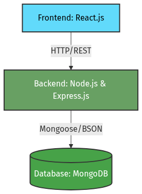
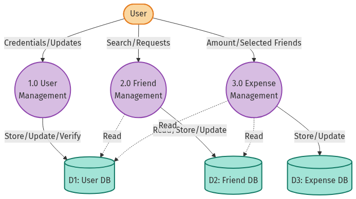
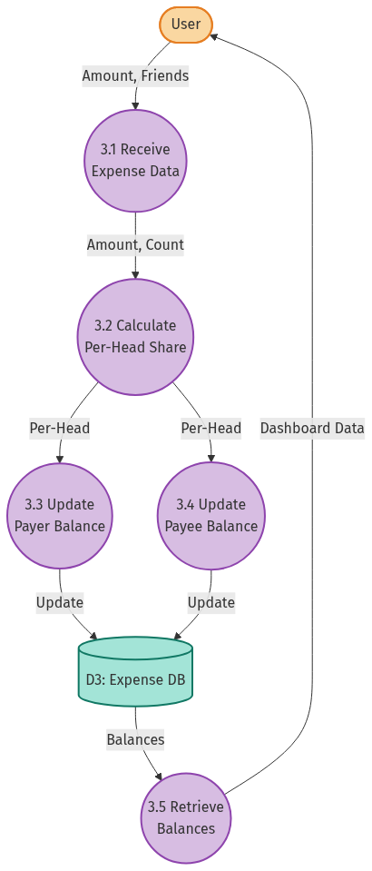
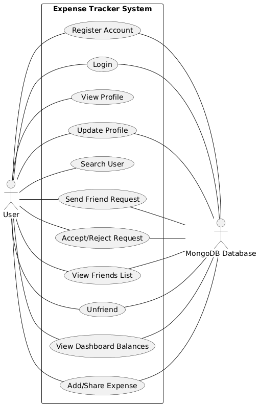
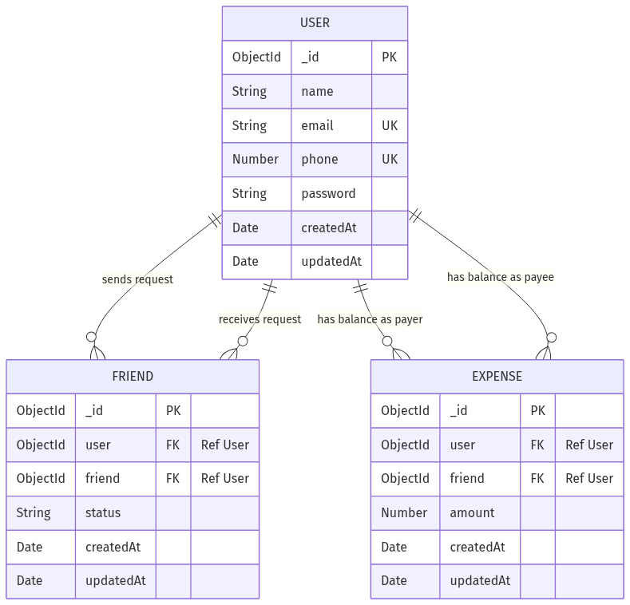
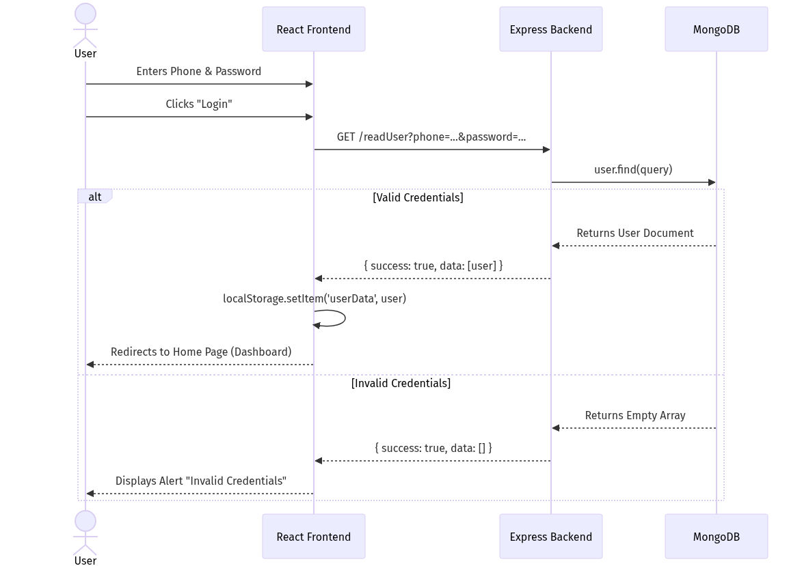

# EXPENSE TRACKER

## A Web-Based Expense Management and Friend Connectivity Application

---

### A Project Report

Submitted in partial fulfilment of the requirements for the award of the degree of

### BACHELOR OF COMPUTER APPLICATIONS (BCA)

---

**Submitted By:**

**Name:** ____________________________

**Roll No:** ____________________________

**Enrollment No:** ____________________________

---

**Under the Guidance of:**

**Guide Name:** ____________________________

**Designation:** ____________________________

---

**Department of Computer Applications**

**[Your College Name]**

**[Your University Name]**

**[City, State]**

**Academic Year: 2025–2026**

---


<p align="center"><i>**Figure 1: College Logo** - Add the official college logo at the top centre of the cover page.</i></p>

---
---

## CERTIFICATE

---

This is to certify that the project report entitled **"Expense Tracker – A Web-Based Expense Management and Friend Connectivity Application"** is a bonafide work carried out by **[Your Name]**, bearing Roll No. **[Your Roll No]** and Enrollment No. **[Your Enrollment No]**, a student of **Bachelor of Computer Applications (BCA)**, in the Department of Computer Applications, **[Your College Name]**, affiliated to **[Your University Name]**, during the academic year **2025–2026**.

This project has been completed under my supervision and guidance, and it is certified that this work has not been submitted elsewhere for the award of any other degree or diploma.

&nbsp;

**Date:** ____________________________

**Place:** ____________________________

&nbsp;

&nbsp;

**Signature of Guide** &emsp;&emsp;&emsp;&emsp;&emsp;&emsp;&emsp;&emsp; **Signature of HOD**

**[Guide Name]** &emsp;&emsp;&emsp;&emsp;&emsp;&emsp;&emsp;&emsp;&emsp;&emsp; **[HOD Name]**

**[Designation]** &emsp;&emsp;&emsp;&emsp;&emsp;&emsp;&emsp;&emsp;&emsp;&emsp; **Head of Department**

**Department of Computer Applications** &emsp;&emsp; **Department of Computer Applications**

&nbsp;

&nbsp;

**External Examiner**

**Name:** ____________________________

**Signature:** ____________________________

---
---

## DECLARATION

---

I, **[Your Name]**, bearing Roll No. **[Your Roll No]** and Enrollment No. **[Your Enrollment No]**, hereby declare that the project report entitled **"Expense Tracker – A Web-Based Expense Management and Friend Connectivity Application"** submitted in partial fulfilment of the requirements for the award of the degree of **Bachelor of Computer Applications (BCA)** from **[Your University Name]** is my own original work.

This project has been carried out under the guidance and supervision of **[Guide Name]**, **[Designation]**, Department of Computer Applications, **[Your College Name]**. The content of this report has not been submitted to any other university or institution for the award of any degree or diploma, either in part or in full.

All the information, data, code, and content presented in this project report are genuine and have been collected and developed by me during the course of this project work. Any external resources, references, or third-party libraries that have been utilised in this project have been duly acknowledged and cited in the references section.

I understand that any misrepresentation of facts or plagiarism found in this report may lead to the cancellation of my degree.

&nbsp;

**Date:** ____________________________

**Place:** ____________________________

&nbsp;

&nbsp;

**Signature of Student**

**[Your Name]**

**Roll No: [Your Roll No]**

---
---

## ACKNOWLEDGEMENT

---

The successful completion of any project requires the help and guidance of many people. I take this opportunity to express my sincere gratitude to all those who have contributed in making this project a reality.

First and foremost, I would like to express my heartfelt gratitude to **Almighty God** for giving me the strength, wisdom, and perseverance to complete this project work successfully.

I am deeply grateful to my project guide, **[Guide Name]**, **[Designation]**, Department of Computer Applications, **[Your College Name]**, for the constant guidance, encouragement, and valuable suggestions throughout the development of this project. Without their continuous support and supervision, this project would not have been possible.

I would like to extend my sincere thanks to **[HOD Name]**, Head of the Department of Computer Applications, for providing the necessary resources and infrastructure to carry out this project work. Their encouragement and administrative support have been invaluable.

I am also thankful to **[Principal Name]**, Principal of **[Your College Name]**, for providing a conducive environment for learning and research, and for granting the necessary permissions to undertake this project.

I owe a special thanks to all the **faculty members** of the Department of Computer Applications for their teachings, guidance, and support throughout my BCA programme. The knowledge and skills I gained from their lectures formed the foundation upon which this project was built.

I would also like to acknowledge my sincere gratitude to my **family members** for their constant encouragement, emotional support, and understanding throughout this journey. Their patience and belief in my abilities kept me motivated during challenging times.

Last but not least, I am thankful to my **friends and classmates** who helped me in various ways during the development and testing phases of this project. Their feedback, suggestions, and moral support played a significant role in the successful completion of this work.

&nbsp;

**[Your Name]**

**[Your College Name]**

**[Date]**

---
---

## ABSTRACT

---

In the modern era of digital transactions and shared living, managing personal expenses and tracking financial interactions among friends has become an increasingly complex challenge. Many individuals, particularly students and young professionals, frequently share expenses for outings, trips, groceries, rent, and various other group activities. However, keeping track of who owes whom and how much can be a tedious and error-prone process when done manually or through informal means such as text messages and notebooks.

The **Expense Tracker** project is a comprehensive, full-stack web application designed to address this very problem. Developed using the **MERN stack** — comprising **MongoDB**, **Express.js**, **React.js**, and **Node.js** — this application provides a seamless, intuitive, and efficient platform for users to manage their expenses and maintain financial transparency among their friend circles.

The application offers a robust set of features including **user registration and authentication**, a **friend management system** with request-accept-reject functionality, an **expense sharing module** that automatically calculates and distributes per-head amounts among selected friends, a **dashboard** that displays expense balances with colour-coded indicators, and a **profile management** feature that allows users to update their personal information.

The system follows a **client-server architecture** where the frontend is built using **React.js** with **React-Bootstrap** for responsive and visually appealing user interface components, and the backend is powered by **Node.js** with **Express.js** providing RESTful API endpoints. **MongoDB** serves as the database, managed through the **Mongoose** ODM library, ensuring efficient data storage, retrieval, and manipulation. **Axios** is used for HTTP communication between the client and the server, while **localStorage** handles user session management on the client side.

The application is designed with scalability, maintainability, and user-friendliness in mind. It employs a well-organised **MVC (Model-View-Controller)** architectural pattern, clean separation of concerns between frontend and backend components, and responsive design principles that ensure the application works seamlessly across different devices and screen sizes.

The project has been deployed on **Vercel** for cloud hosting, and the complete source code is maintained on **GitHub** for version control and collaborative development. This project demonstrates the practical application of modern web development technologies and serves as a comprehensive example of building real-world, production-ready applications using the MERN stack.

**Keywords:** Expense Tracker, MERN Stack, MongoDB, Express.js, React.js, Node.js, Friend Management, Expense Sharing, RESTful API, Web Application, Full-Stack Development.

---
---

## TABLE OF CONTENTS

---

| S. No. | Chapter Title | Page No. |
|--------|----------------------------------------------|----------|
| | Cover Page | i |
| | Certificate | ii |
| | Declaration | iii |
| | Acknowledgement | iv |
| | Abstract | v |
| | Table of Contents | vi |
| 1 | Introduction | 1 |
| 2 | Existing System | 5 |
| 3 | Proposed System | 8 |
| 4 | Problem Statement | 11 |
| 5 | Objectives of the Project | 13 |
| 6 | Scope of the Project | 15 |
| 7 | Technology Stack | 17 |
| 8 | System Requirements | 24 |
| 9 | Feasibility Study | 27 |
| 10 | System Architecture | 30 |
| 11 | Data Flow Diagram | 33 |
| 12 | Use Case Diagram | 36 |
| 13 | ER Diagram | 39 |
| 14 | Database Design | 41 |
| 15 | Folder Structure | 46 |
| 16 | Project Workflow | 48 |
| 17 | Authentication Flow | 51 |
| 18 | Features Explanation | 54 |
| 19 | CRUD Operations | 59 |
| 20 | API Routes | 63 |
| 21 | Middleware Explanation | 66 |
| 22 | Session and Local Storage Handling | 68 |
| 23 | NPM Packages Used | 70 |
| 24 | Flow of Web Application | 76 |
| 25 | Deployment Process | 79 |
| 26 | GitHub Repository Management | 82 |
| 27 | Testing | 84 |
| 28 | Screenshots Section | 87 |
| 29 | Advantages of the Project | 92 |
| 30 | Limitations | 94 |
| 31 | Future Enhancements | 96 |
| 32 | Conclusion | 98 |
| 33 | References | 100 |

---
---


## LIST OF FIGURES

| Figure No. | Title | Type |
| --- | --- | --- |
| 1 | College Logo | Screenshot |
| 2 | System Architecture Diagram | Diagram |
| 3 | MVC Architecture Diagram | Diagram |
| 4 | Context Level DFD — Level 0 | Diagram |
| 5 | Level 1 DFD | Diagram |
| 6 | Level 2 DFD — Expense Management | Diagram |
| 7 | Use Case Diagram | Diagram |
| 8 | ER Diagram | Diagram |
| 9 | MongoDB Users Collection Screenshot | Screenshot |
| 10 | MongoDB Friends Collection Screenshot | Screenshot |
| 11 | MongoDB Expenses Collection Screenshot | Screenshot |
| 12 | Folder Structure Screenshot | Screenshot |
| 13 | Authentication Flow Diagram | Diagram |
| 14 | Signup Page Screenshot | Screenshot |
| 15 | Login Page Screenshot | Screenshot |
| 16 | Header/Navbar Screenshot | Screenshot |
| 17 | Home Page Screenshot | Screenshot |
| 18 | Friends Page Screenshot | Screenshot |
| 19 | Request Page Screenshot | Screenshot |
| 20 | Expense Page Screenshot | Screenshot |
| 21 | Profile Page Screenshot | Screenshot |
| 22 | Mobile Responsive View Screenshot | Screenshot |
| 23 | GitHub Repository Screenshot | Screenshot |
| 24 | Git Terminal Commands Screenshot | Screenshot |
| 25 | Vercel Deployment Screenshot | Screenshot |
| 26 | Vercel Build Logs Screenshot | Screenshot |
| 27 | GitHub Repository File Structure Screenshot | Screenshot |
| 28 | Terminal Screenshot showing server running | Screenshot |
| 29 | Login Page Screenshot | Screenshot |
| 30 | Signup Page Screenshot | Screenshot |
| 31 | Home Page / Dashboard Screenshot | Screenshot |
| 32 | Navigation Bar Screenshot | Screenshot |
| 33 | Friends Page Screenshot | Screenshot |
| 34 | Request Page Screenshot | Screenshot |
| 35 | Expense Page Screenshot | Screenshot |
| 36 | Profile Page Screenshot | Screenshot |
| 37 | MongoDB Database Screenshot | Screenshot |
| 38 | MongoDB Users Collection Screenshot | Screenshot |
| 39 | MongoDB Friends Collection Screenshot | Screenshot |
| 40 | MongoDB Expenses Collection Screenshot | Screenshot |
| 41 | Vercel Deployment Dashboard Screenshot | Screenshot |
| 42 | GitHub Repository Screenshot | Screenshot |
| 43 | VS Code File Structure Screenshot | Screenshot |
| 44 | Terminal Server Running Screenshot | Screenshot |
| 45 | Mobile Responsive View Screenshot | Screenshot |

---

## CHAPTER 1: INTRODUCTION

---

### 1.1 Overview

In today's fast-paced digital world, managing personal finances and keeping track of shared expenses has become an essential aspect of daily life. Whether it is splitting a restaurant bill, sharing rent with roommates, contributing to a group trip, or simply lending money to a friend, financial interactions between people happen frequently and in varying amounts. Without a proper tracking mechanism, these small transactions can quickly become confusing, leading to misunderstandings, disputes, and strained relationships.

The **Expense Tracker** is a modern, full-stack web application that has been designed and developed to solve this exact problem. It serves as a centralised platform where users can register, connect with their friends, and accurately track all shared expenses between them. The application automatically calculates the per-head share of each expense and maintains a running balance between every pair of connected friends, making it effortless for users to know exactly who owes whom and how much at any given point in time.

This project has been developed using the **MERN stack**, which is one of the most popular and widely-used technology stacks for building modern web applications. MERN stands for **MongoDB**, **Express.js**, **React.js**, and **Node.js** — four powerful technologies that, when combined, provide a complete framework for building dynamic, responsive, and scalable web applications entirely using JavaScript as the programming language.

### 1.2 Background and Motivation

The idea for this project emerged from a common, everyday problem faced by students and young professionals. In college hostels, shared apartments, and friend groups, expenses are frequently shared among multiple people. For example, when a group of friends goes out for dinner, one person usually pays the entire bill, and the others are expected to pay back their share later. Over time, with multiple such transactions happening, it becomes extremely difficult to remember and track every amount that is owed or receivable.

Traditionally, people have relied on informal methods to track shared expenses — such as noting amounts in notebooks, sending reminders through text messages, or simply relying on memory. However, these methods are highly unreliable and prone to errors. A person may forget to note down a transaction, misremember an amount, or lose the notebook altogether. These issues often lead to financial disputes and can even damage friendships.

While there are some existing applications available in the market that address this problem, many of them are either too complex for casual users, require paid subscriptions for basic features, or do not provide the specific combination of expense tracking and friend management that many users need. This gap in the market served as the primary motivation for developing the Expense Tracker application.

### 1.3 Purpose of the Project

The primary purpose of this project is to provide a **simple, intuitive, and efficient** web-based solution for tracking shared expenses among friends. The application aims to:

- Allow users to register and create their personal accounts securely
- Enable users to search for and connect with their friends within the platform
- Provide a streamlined mechanism for adding and sharing expenses among multiple friends
- Automatically calculate the per-head share and update balances accordingly
- Display a clear, colour-coded dashboard showing all expense balances
- Allow users to manage their profiles and update personal information
- Provide a responsive user interface that works across different devices

### 1.4 Significance of the Project

This project holds significant value from both academic and practical perspectives. From an academic standpoint, it demonstrates the practical application of numerous concepts learned during the BCA programme, including:

- **Web Development:** Building a complete, production-ready web application using modern technologies
- **Database Management:** Designing and implementing a NoSQL database with proper schemas, relationships, and indexing
- **Software Engineering:** Following the MVC architectural pattern, implementing RESTful APIs, and maintaining clean code practices
- **Client-Server Communication:** Understanding and implementing HTTP requests, API calls, and data serialisation
- **User Interface Design:** Creating responsive, user-friendly interfaces using component-based architecture

From a practical standpoint, the Expense Tracker application addresses a genuine, real-world problem and provides a solution that can be used by students, roommates, colleagues, and friend groups to manage their shared finances effectively. The application eliminates the need for manual tracking and reduces the chances of financial disputes arising from forgotten or miscalculated amounts.

### 1.5 Project Development Approach

The development of this project followed a systematic and structured approach. The project was developed using **Visual Studio Code (VS Code)** as the primary code editor, which provided powerful features such as IntelliSense, integrated terminal, Git integration, and a vast ecosystem of extensions that significantly enhanced the development experience.

The project was developed in an iterative manner, with each iteration focusing on building and testing a specific module of the application. The development process can be broadly divided into the following phases:

1. **Requirement Analysis:** Understanding and documenting the functional and non-functional requirements of the application
2. **System Design:** Designing the system architecture, database schemas, API endpoints, and user interface wireframes
3. **Backend Development:** Setting up the Node.js server, creating Express.js routes, implementing controllers, and designing Mongoose models
4. **Frontend Development:** Building the React.js components, implementing routing, creating forms, and integrating with the backend APIs
5. **Integration and Testing:** Connecting the frontend with the backend, testing all features, and fixing bugs
6. **Deployment:** Deploying the application on Vercel and pushing the source code to GitHub

### 1.6 Organisation of the Report

This project report has been organised into multiple chapters, each covering a specific aspect of the project. The report begins with introductory chapters that provide the context, problem statement, and objectives. It then moves on to technical chapters that explain the technology stack, system architecture, database design, and implementation details. The report concludes with chapters on testing, screenshots, advantages, limitations, and future enhancements. Each chapter has been written in a detailed and comprehensive manner to provide a thorough understanding of the project.

---
---

## CHAPTER 2: EXISTING SYSTEM

---

### 2.1 Introduction to Existing Systems

Before developing any software application, it is essential to study and analyse the existing systems that are already available in the market. This analysis helps in understanding the strengths and weaknesses of current solutions, identifying gaps that need to be addressed, and ensuring that the proposed system offers meaningful improvements over what is already available.

In the domain of expense tracking and shared finance management, several applications and methods are currently in use. These range from traditional manual methods to sophisticated mobile and web applications. Let us examine each of these in detail.

### 2.2 Manual Methods

The most basic and traditional method of tracking shared expenses involves the use of **pen and paper**. Many people, especially in informal settings, simply write down the amounts owed or receivable in a notebook or on slips of paper. While this method is simple and requires no technology, it has several significant drawbacks:

- **Prone to Errors:** Manual calculations are susceptible to arithmetic mistakes, especially when multiple transactions are involved
- **Easy to Lose:** Notebooks and paper slips can be lost, damaged, or misplaced, leading to loss of all recorded data
- **No Real-Time Updates:** Other parties involved in the transaction have no way of seeing or verifying the recorded amounts
- **Difficult to Scale:** As the number of friends and transactions increases, manual tracking becomes increasingly cumbersome and unmanageable
- **No Historical Records:** It is difficult to maintain a chronological history of all past transactions for reference

### 2.3 Spreadsheet-Based Tracking

Some tech-savvy individuals use **spreadsheet applications** such as Microsoft Excel or Google Sheets to track shared expenses. Spreadsheets offer more structure than pen and paper and provide basic calculation features. However, they come with their own set of limitations:

- **Complex Setup:** Creating and maintaining a proper expense tracking spreadsheet requires time and effort to set up formulas, formatting, and data validation
- **Not Purpose-Built:** Spreadsheets are general-purpose tools and lack the specific features needed for expense tracking, such as friend management, automatic splitting, and balance calculations
- **Collaboration Challenges:** While cloud-based spreadsheets like Google Sheets support collaboration, managing permissions and ensuring data consistency can be challenging
- **No Mobile-Friendly Interface:** Spreadsheets are not designed for mobile devices, making it inconvenient to add expenses on the go
- **No Notifications:** Spreadsheets do not provide alerts or notifications when expenses are added or balances change

### 2.4 Existing Mobile and Web Applications

Several mobile and web applications are available in the market that are specifically designed for expense tracking and splitting. Some of the most popular ones include:

**Splitwise:**
Splitwise is one of the most well-known expense splitting applications. It allows users to add expenses, split them among group members, and keep track of balances. While Splitwise is feature-rich, it has a paid subscription model for advanced features, and some users find its interface overly complex for simple use cases.

**Google Pay / PhonePe Split:**
Some digital payment applications offer basic expense splitting features. However, these features are usually limited in scope and are tightly integrated with the payment platform, making them less flexible for users who prefer other payment methods.

**Tricount:**
Tricount is another expense sharing application that allows users to create groups and track shared expenses. While it is simpler than Splitwise, it may lack some advanced features that power users need.

### 2.5 Limitations of Existing Systems

After careful analysis of the existing systems, the following key limitations have been identified:

- **Cost:** Many existing applications require paid subscriptions for advanced or even basic features, making them inaccessible for students and budget-conscious users
- **Complexity:** Some applications are overly feature-rich, making them complex and confusing for users who simply want to track basic shared expenses
- **Privacy Concerns:** Many commercial applications collect and store sensitive financial data on their servers, raising privacy and data security concerns
- **Platform Dependency:** Most existing solutions are available only as mobile applications, with limited or no web-based access
- **Limited Customisation:** Users often cannot customise the application to suit their specific needs or workflows
- **Internet Dependency:** Many applications require constant internet connectivity to function, making them unreliable in areas with poor network coverage

### 2.6 Need for a New System

Given the limitations of existing systems, there is a clear need for a new, purpose-built expense tracking application that is:

- **Free to use** with no hidden charges or subscription requirements
- **Simple and intuitive** with a clean, easy-to-understand user interface
- **Web-based** and accessible from any device with a web browser
- **Feature-complete** with all essential features including user management, friend connectivity, expense tracking, and balance display
- **Built on modern technologies** that ensure performance, scalability, and maintainability
- **Open-source** with the source code available on GitHub for transparency and community contribution

The Expense Tracker application has been developed to meet all these requirements and provide a superior alternative to the existing systems.

---
---

## CHAPTER 3: PROPOSED SYSTEM

---

### 3.1 Introduction to the Proposed System

The proposed system, **Expense Tracker**, is a modern, full-stack web application that provides a comprehensive solution for managing shared expenses and maintaining friend connectivity. Unlike existing systems that are either too complex, too expensive, or too limited in functionality, the Expense Tracker has been designed with a focus on simplicity, usability, and completeness.

The application is built using the **MERN stack** — MongoDB, Express.js, React.js, and Node.js — which provides a unified JavaScript-based development environment for both the frontend and backend. This technology choice ensures a seamless development experience, excellent performance, and the ability to leverage a vast ecosystem of open-source libraries and tools.

### 3.2 Key Features of the Proposed System

The proposed system offers the following key features:

**User Registration and Authentication:**
- New users can create an account by providing their name, email address, phone number, and password
- Existing users can log in using their phone number and password
- User authentication is handled through localStorage for session persistence
- Automatic redirection to the dashboard for already logged-in users

**Friend Management System:**
- Users can search for other registered users by their phone number
- Friend requests can be sent to found users
- Incoming friend requests can be accepted or rejected
- A dedicated friends page displays all connected (accepted) friends
- Friends can be removed (unfriended) if desired
- Duplicate friend requests and self-requests are prevented

**Expense Sharing Module:**
- Users can add a new expense by entering the total amount
- The expense can be shared among selected friends from the friend list
- The application automatically calculates the per-head share by dividing the total amount by the number of selected friends
- Balances are updated in real-time for both the payer and the payees
- The system maintains separate records for each pair of friends, ensuring accurate balance tracking

**Dashboard and Balance Display:**
- The home page displays all expense balances as visually appealing cards
- Each card shows the friend's name, phone number, and the current balance amount
- Positive balances (money receivable) are displayed in **green** colour
- Negative balances (money owed) are displayed in **red** colour
- Last transaction date and time are shown for each balance entry

**Profile Management:**
- Users can view and update their profile information including name and password
- Email and phone number fields are displayed but disabled for editing to maintain data integrity
- Profile updates are reflected immediately in the localStorage

**Responsive Navigation:**
- A clean, responsive navigation bar provides easy access to all sections of the application
- Navigation links include Home, Friend, Expense, Request, and Profile
- The logged-in user's name is displayed in the navigation bar
- A logout button allows users to securely end their session

### 3.3 Advantages of the Proposed System Over Existing Systems

The proposed system offers several distinct advantages over existing systems:

- **Completely Free:** The application is free to use with no subscription charges, premium tiers, or hidden costs
- **Simple and Intuitive:** The user interface has been designed to be clean, minimal, and easy to understand, even for first-time users
- **Web-Based Access:** Being a web application, it can be accessed from any device with a web browser — desktops, laptops, tablets, and mobile phones
- **Automatic Calculations:** The application automatically handles all calculations including per-head splitting and balance updates, eliminating the possibility of human errors
- **Real-Time Balance Tracking:** Balances are updated instantly when expenses are added, providing users with an always-current view of their financial standing with each friend
- **Colour-Coded Indicators:** The use of green and red colours for positive and negative balances makes it immediately apparent who owes whom
- **Modern Technology Stack:** Built using the latest versions of industry-standard technologies, ensuring excellent performance, security, and maintainability
- **Open Source:** The complete source code is available on GitHub, promoting transparency and allowing the community to contribute improvements

### 3.4 System Workflow Overview

The overall workflow of the proposed system can be summarised as follows:

1. A new user visits the application and creates an account through the Signup page
2. The user logs in using their phone number and password on the Login page
3. Upon successful authentication, the user is redirected to the Home page (Dashboard)
4. The user navigates to the Request page to search for friends by phone number and send friend requests
5. When a friend accepts the request, both users become connected
6. The user navigates to the Expense page, selects friends, enters an expense amount, and adds the expense
7. The application calculates the per-head share and updates balances for all selected friends
8. The Home page dashboard displays the updated balances with colour-coded indicators
9. The user can view their connected friends on the Friends page or update their profile on the Profile page
10. The user can log out securely by clicking the Logout button in the navigation bar

### 3.5 Target Users

The proposed system is primarily targeted at the following user groups:

- **College Students:** Who frequently share expenses for food, outings, stationery, and group activities
- **Roommates:** Who need to split rent, utilities, groceries, and household expenses
- **Friend Groups:** Who regularly go on trips, dinners, or events and need to split costs
- **Colleagues:** Who share office-related expenses such as team lunches, gifts, or event contributions
- **Family Members:** Who need to track shared household or family expenses

---
---

## CHAPTER 4: PROBLEM STATEMENT

---

### 4.1 Identifying the Problem

In our daily lives, we frequently encounter situations where expenses need to be shared among friends, family members, or colleagues. These situations are commonplace and occur with remarkable regularity — from splitting a dinner bill to sharing the cost of a birthday gift, from dividing rent among roommates to pooling resources for a group trip.

The fundamental problem that this project aims to solve can be stated as follows:

**"There is a lack of a simple, free, and efficient web-based tool that enables users to track shared expenses among friends, automatically calculate per-head shares, maintain running balances, and manage friend connectivity — all within a single, unified platform."**

### 4.2 Detailed Analysis of the Problem

To understand the problem comprehensively, let us break it down into its constituent aspects:

**The Calculation Problem:**
When an expense is shared among a group of friends, the total amount needs to be divided equally among all participants. While this is straightforward for a single transaction, the complexity increases exponentially when there are multiple transactions over time, with different subsets of friends involved in each transaction. Manually keeping track of all these calculations is not only tedious but also error-prone.

For example, consider a group of four friends — A, B, C, and D:
- A pays Rs. 400 for dinner (shared among A, B, C, D — each owes Rs. 100)
- B pays Rs. 300 for snacks (shared among B, C, D — each owes Rs. 100)
- C pays Rs. 600 for movie tickets (shared among A, B, C — each owes Rs. 200)

After just three transactions, calculating who owes whom and how much becomes a complex exercise. Now imagine this happening over weeks and months — the calculation problem becomes virtually unmanageable without a proper tool.

**The Memory Problem:**
Human memory is fallible. People often forget about small transactions, misremember amounts, or disagree about who paid for what. This leads to confusion, arguments, and even strained relationships. A reliable, permanent record of all transactions is essential to avoid such issues.

**The Connectivity Problem:**
In order to share expenses, friends need to be connected on a common platform. Traditional methods like phone calls or text messages are informal and do not provide a structured way to manage financial interactions. A proper friend management system with request-accept-reject functionality is needed to establish and manage these connections.

**The Accessibility Problem:**
Many existing solutions are platform-specific (only available on iOS or Android) or require paid subscriptions. This limits their accessibility, especially for students and users who may not be willing or able to pay for such services. A free, web-based solution that can be accessed from any device is needed.

### 4.3 Consequences of the Problem

If the problem of untracked shared expenses is left unaddressed, it can lead to several negative consequences:

- **Financial Losses:** People may end up paying more than their fair share or fail to collect amounts owed to them
- **Damaged Relationships:** Financial disputes are one of the most common causes of strained friendships and broken relationships
- **Stress and Anxiety:** Constantly worrying about who owes what can cause unnecessary stress and anxiety
- **Wasted Time:** Manually tracking, calculating, and reconciling shared expenses is a time-consuming process
- **Inaccurate Records:** Without a proper system, financial records are likely to be incomplete, inaccurate, or non-existent

### 4.4 Scope of the Solution

The Expense Tracker application addresses all the above-mentioned aspects of the problem by providing:

- **Automated Calculations:** The application automatically calculates per-head shares and updates balances, eliminating the need for manual calculations
- **Permanent Records:** All transactions are stored in a MongoDB database, providing a permanent, reliable record of all expenses
- **Friend Management:** A built-in friend management system allows users to search, connect, and manage their friends on the platform
- **Web-Based Access:** Being a web application, it can be accessed from any device with a web browser, at any time, from anywhere
- **Free and Open Source:** The application is completely free to use and the source code is available on GitHub

---
---

## CHAPTER 5: OBJECTIVES OF THE PROJECT

---

### 5.1 Primary Objectives

The primary objectives of the Expense Tracker project are as follows:

1. **To develop a user-friendly web application** that allows users to track and manage shared expenses among friends in a simple and efficient manner.

2. **To implement a secure user authentication system** that enables users to register with their personal details and log in using their phone number and password, with session management through localStorage.

3. **To build a comprehensive friend management module** that allows users to search for other registered users, send friend requests, accept or reject incoming requests, view connected friends, and remove friends when needed.

4. **To create an intelligent expense sharing feature** that automatically divides the total expense amount equally among selected friends and updates the running balance for each friend pair in real-time.

5. **To design an informative dashboard** that displays all expense balances in a visually clear and intuitive manner, using colour-coded indicators to differentiate between amounts receivable and amounts payable.

6. **To provide a profile management feature** that allows users to view and update their personal information such as name and password.

7. **To deploy the application on a cloud platform (Vercel)** for public accessibility and to maintain the source code on GitHub for version control and transparency.

### 5.2 Secondary Objectives

In addition to the primary objectives, the project also aims to achieve the following secondary objectives:

1. **To demonstrate proficiency in full-stack web development** using the MERN stack (MongoDB, Express.js, React.js, Node.js).

2. **To implement RESTful API design principles** for building scalable and maintainable backend services.

3. **To practice the MVC (Model-View-Controller) architectural pattern** for organising the application code in a clean and structured manner.

4. **To gain hands-on experience with NoSQL database design** using MongoDB and Mongoose, including schema design, indexing, and population of referenced documents.

5. **To build responsive user interfaces** using React-Bootstrap that adapt to different screen sizes and provide a consistent user experience across devices.

6. **To understand and implement client-server communication** using Axios for making HTTP requests from the React frontend to the Express.js backend.

7. **To learn and apply deployment practices** including hosting web applications on cloud platforms and using version control systems for source code management.

### 5.3 Learning Objectives

From an educational perspective, this project aims to help the developer gain practical knowledge and skills in the following areas:

- Understanding the complete lifecycle of a software development project, from requirement gathering to deployment
- Working with JavaScript as a full-stack language for both frontend and backend development
- Designing and implementing RESTful APIs with proper HTTP methods, route naming, and response formats
- Working with MongoDB for data storage, including CRUD operations, document relationships, and indexing
- Building modern, component-based user interfaces using React.js and managing application state using hooks
- Using npm (Node Package Manager) for managing project dependencies and scripts
- Implementing client-side routing using React Router DOM
- Understanding and applying CORS (Cross-Origin Resource Sharing) policies for secure API communication
- Deploying full-stack applications to cloud hosting platforms

---
---

## CHAPTER 6: SCOPE OF THE PROJECT

---

### 6.1 Current Scope

The current scope of the Expense Tracker project encompasses the following functional areas:

**User Management:**
- User registration with name, email, phone number, and password
- User login with phone number and password
- Profile viewing and updating (name and password)
- Session management using localStorage
- Secure logout functionality

**Friend Management:**
- Searching for registered users by phone number
- Sending friend requests to found users
- Viewing incoming friend requests with sender details
- Accepting or rejecting pending friend requests
- Viewing the list of all connected (accepted) friends
- Removing (unfriending) connected friends
- Prevention of duplicate requests and self-requests

**Expense Management:**
- Adding new expenses with a specified total amount
- Selecting multiple friends to share the expense with
- Automatic calculation of per-head share (total amount ÷ number of selected friends)
- Real-time balance updates for both the payer and payees
- Viewing all expense balances on the dashboard with colour-coded indicators
- Display of last transaction date and time for each balance

**User Interface:**
- Responsive navigation bar with links to all major sections
- Clean, Bootstrap-based layout with consistent styling
- Form validation and error handling with alert messages
- Password show/hide toggle for security and convenience

### 6.2 Technical Scope

From a technical perspective, the project covers the following:

- **Frontend:** React.js application created with Create React App, using functional components, React hooks (useState, useEffect), React Router DOM for routing, React-Bootstrap for UI components, and Axios for API communication
- **Backend:** Node.js server with Express.js framework, implementing RESTful API endpoints for user, friend, and expense operations, with CORS middleware for cross-origin access
- **Database:** MongoDB database with three collections (users, friends, expenses), Mongoose schemas with validation, references, timestamps, and compound unique indexes
- **Deployment:** Cloud deployment on Vercel with environment configuration, and source code management on GitHub

### 6.3 Limitations of Current Scope

While the project covers a comprehensive set of features, the following areas are currently outside its scope:

- **Password Encryption:** The current implementation stores passwords in plain text; hashing with libraries like bcrypt is planned for future versions
- **Token-Based Authentication:** JWT (JSON Web Token) based authentication is not implemented in the current version
- **Email Verification:** New user registration does not include email verification
- **Push Notifications:** Real-time notifications for new friend requests or expenses are not implemented
- **Group Expenses:** The current system supports only individual-level expense splitting; named group creation and group-level expense management are not available
- **Payment Integration:** The application does not integrate with any payment gateway for direct settlement of dues
- **Export/Reports:** There is no functionality to export expense reports as PDF or Excel files

### 6.4 Future Scope

The project has been designed with extensibility in mind, and the following enhancements are planned for future versions:

- Implementation of bcrypt-based password hashing for enhanced security
- JWT-based authentication with refresh tokens
- Email verification during registration using services like NodeMailer
- Real-time notifications using WebSocket or Socket.io
- Group creation and group-level expense management
- Integration with payment gateways for direct settlement
- Expense categories and tags for better organisation
- Export functionality for generating financial reports
- Dark mode support for improved user experience
- Progressive Web App (PWA) capabilities for offline access

---
---

## CHAPTER 7: TECHNOLOGY STACK

---

### 7.1 Overview of the Technology Stack

The Expense Tracker application is built using the **MERN stack**, which is a collection of JavaScript-based technologies used for building modern web applications. The MERN stack is one of the most popular technology stacks in the web development industry, and it is widely used by startups, enterprises, and individual developers alike.

The acronym MERN stands for:

- **M** — MongoDB (Database)
- **E** — Express.js (Backend Framework)
- **R** — React.js (Frontend Library)
- **N** — Node.js (Runtime Environment)

The key advantage of the MERN stack is that it uses **JavaScript** as the programming language across all layers of the application — from the frontend user interface to the backend server logic to the database queries. This unified language approach simplifies the development process, reduces the learning curve, and enables code sharing between the frontend and backend.

### 7.2 Frontend Technologies

#### 7.2.1 HTML (HyperText Markup Language)

**HTML** is the standard markup language used for creating the structure of web pages. It provides the skeletal framework upon which all web content is built. In the context of this project, HTML is used within React JSX (JavaScript XML) syntax to define the structure of each component's render output.

HTML5, the latest version of HTML, provides several semantic elements such as `<header>`, `<nav>`, `<main>`, `<section>`, `<article>`, and `<footer>` that give meaning to the structure of web content. While React uses JSX instead of plain HTML, the underlying structure still follows HTML conventions and standards.

Key HTML elements used in this project include:
- `<div>` — For creating layout containers and grouping elements
- `<form>` — For user input forms (login, signup, profile update)
- `<input>` — For text fields, number fields, email fields, and password fields
- `<button>` — For interactive actions like login, signup, submit, accept, reject
- `<p>` — For displaying text content such as names, amounts, and messages
- `<a>` and `<Link>` — For navigation between different pages

#### 7.2.2 CSS (Cascading Style Sheets)

**CSS** is a styling language used to control the visual presentation of web pages. It defines how HTML elements should be displayed, including properties such as colours, fonts, spacing, layouts, animations, and responsive behaviour.

In this project, CSS is used in two forms:

1. **Custom CSS Files:** Each component has its own dedicated CSS file (e.g., Login.css, Signup.css, Home.css, Header.css) that contains component-specific styles. This approach ensures modularity and prevents style conflicts between different components.

2. **Bootstrap CSS Classes:** The project extensively uses Bootstrap's utility classes (e.g., `d-flex`, `justify-content-center`, `align-items-center`, `w-100`, `vh-100`, `mt-3`, `p-3`) for rapid layout development and responsive design.

Key CSS concepts used in this project include:
- **Flexbox Layout:** Used extensively for centering content, creating row/column layouts, and distributing space
- **Responsive Design:** Ensuring the layout adapts to different screen sizes using Bootstrap's grid system and responsive classes
- **Box Model:** Using margin, padding, border, and width/height properties for element sizing and spacing
- **Visual Styling:** Background colours, border styles, box shadows, font sizes, and text colours for aesthetic appeal

#### 7.2.3 JavaScript (ES6+)

**JavaScript** is the programming language that powers the interactive behaviour of the web application. The project uses modern JavaScript (ES6 and later versions) features extensively, including:

- **Arrow Functions:** `const loginUser = (data) => { ... }` — Concise syntax for defining functions
- **Template Literals:** `` `http://localhost:5000/readUser?phone=${phone}` `` — String interpolation for building dynamic URLs
- **Destructuring:** `const { saveUser, readUser, updateUser, deleteUser } = require("../controller/userController")` — Extracting values from objects
- **Async/Await:** `const getFrineds = async (userId) => { ... }` — Asynchronous programming for API calls
- **Optional Chaining:** `userData?.name` — Safely accessing nested object properties
- **Nullish Coalescing:** `userData?.amount ?? 0` — Providing default values for null/undefined
- **Spread Operator:** `[...response.data.data, { ... }]` — Creating new arrays with additional elements
- **Const and Let:** Block-scoped variable declarations for better code safety
- **Array Methods:** `.map()`, `.filter()`, `.includes()` — Functional array operations

#### 7.2.4 React.js

**React.js** (commonly referred to as React) is a free and open-source JavaScript library for building user interfaces, maintained by Meta (formerly Facebook) and a community of individual developers and companies. React allows developers to create reusable UI components and manage the application's view layer efficiently.

Key React concepts used in this project:

- **Functional Components:** All components in this project are written as functional components using arrow function syntax. For example, `const Login = () => { ... }`.

- **JSX (JavaScript XML):** React uses JSX syntax that allows HTML-like code to be written directly within JavaScript files. This makes the code more readable and intuitive.

- **React Hooks:**
  - `useState` — Used for managing component-level state (e.g., form inputs, fetched data, toggle states)
  - `useEffect` — Used for performing side effects such as API calls on component mount, checking localStorage for existing sessions, and navigation redirects
  - `useNavigate` — Used for programmatic navigation between routes

- **Component-Based Architecture:** The application is divided into reusable components, each responsible for a specific piece of the user interface. Components are organised into two categories:
  - **Container Components** (Login, Signup, Home, Profile, Request, Friend, Expense) — Page-level components that handle business logic and state management
  - **Presentational Components** (Header, MainLayout) — Layout components that provide structure and navigation

- **Client-Side Routing:** React Router DOM is used for implementing single-page application (SPA) routing, allowing navigation between different views without full page reloads.

#### 7.2.5 React-Bootstrap

**React-Bootstrap** is a popular library that provides Bootstrap components rebuilt as React components. It replaces the Bootstrap JavaScript dependency with React components, giving developers full control over each component's behaviour and appearance.

React-Bootstrap components used in this project include:

- `Button` — For interactive buttons with Bootstrap styling (primary, danger, success variants)
- `Form` and `Form.Control` — For form inputs with proper validation styling
- `Form.Check` — For checkbox inputs in the expense friend selection
- `FloatingLabel` — For form inputs with floating label animation
- `Navbar`, `Nav`, `Navbar.Brand`, `Navbar.Toggle`, `Navbar.Collapse` — For the responsive navigation bar
- `Container` — For responsive container layouts

#### 7.2.6 Bootstrap

**Bootstrap** is the world's most popular CSS framework for building responsive, mobile-first websites. In this project, Bootstrap v5.3.8 is used along with the **Bootswatch** library, which provides free themes for Bootstrap.

Bootstrap features used in this project:
- **Grid System:** 12-column responsive grid for layout structure (`col-md-6`, `col-md-8`, `col-md-4`)
- **Utility Classes:** Flexbox utilities, spacing utilities, text utilities, and display utilities
- **Components:** Cards, forms, buttons, and navigation components
- **Responsive Design:** Built-in responsive breakpoints for different screen sizes

### 7.3 Backend Technologies

#### 7.3.1 Node.js

**Node.js** is a free, open-source, cross-platform JavaScript runtime environment that allows developers to execute JavaScript code outside of a web browser. Built on Chrome's V8 JavaScript engine, Node.js provides an event-driven, non-blocking I/O model that makes it lightweight and efficient.

In this project, Node.js serves as the runtime environment for the backend server. It handles:
- Running the Express.js server on port 5000
- Connecting to the MongoDB database
- Processing incoming HTTP requests
- Executing controller logic
- Sending HTTP responses back to the client

Key characteristics of Node.js that benefit this project:
- **Single Language:** Using JavaScript on both frontend and backend simplifies development
- **Non-Blocking I/O:** Efficient handling of multiple simultaneous database queries and API requests
- **NPM Ecosystem:** Access to hundreds of thousands of packages for extended functionality
- **Fast Execution:** V8 engine compiles JavaScript to machine code for optimal performance

#### 7.3.2 Express.js

**Express.js** is a minimal and flexible Node.js web application framework that provides a robust set of features for building web and mobile applications. It is the de facto standard server framework for Node.js and is the "E" in the MERN stack.

In this project, Express.js is used to:
- Create and configure the HTTP server
- Define API routes for user, friend, and expense operations
- Mount middleware functions (CORS, JSON body parser)
- Handle request parsing and response formatting
- Organise routes using Express Router

Key Express.js features used in this project:
- `express()` — Creating an Express application instance
- `app.use()` — Mounting middleware functions
- `express.json()` — Built-in middleware for parsing JSON request bodies
- `express.Router()` — Creating modular route handlers
- HTTP methods — `router.get()`, `router.post()`, `router.put()`, `router.delete()`
- `app.listen()` — Starting the server on a specified port

### 7.4 Database Technology

#### 7.4.1 MongoDB

**MongoDB** is a cross-platform, document-oriented NoSQL database that stores data in flexible, JSON-like documents called BSON (Binary JSON). Unlike traditional relational databases that use tables and rows, MongoDB uses collections and documents, providing greater flexibility and scalability.

In this project, MongoDB is used as the primary data store for:
- **User Data:** Storing user registration information (name, email, phone, password)
- **Friend Relationships:** Storing friend connections with status (pending, accepted, rejected)
- **Expense Records:** Storing expense balances between friend pairs

Key MongoDB features utilised in this project:
- **Document Model:** Flexible schema design that allows each document to have different fields
- **Indexing:** Compound unique indexes on friend and expense collections to prevent duplicate entries
- **References:** ObjectId references between collections for data relationships
- **Timestamps:** Automatic creation of `createdAt` and `updatedAt` fields
- **Upsert Operations:** Insert or update operations used in expense management

#### 7.4.2 Mongoose

**Mongoose** is an Object Data Modelling (ODM) library for MongoDB and Node.js. It provides a schema-based solution to model application data, offering built-in type casting, validation, query building, and business logic hooks.

In this project, Mongoose is used to:
- Define schemas for the User, Friend, and Expense collections
- Create and export Mongoose models
- Perform CRUD operations using model methods
- Establish relationships between collections using ObjectId references
- Create compound unique indexes
- Populate referenced documents in queries

### 7.5 Additional Technologies and Tools

#### 7.5.1 CORS (Cross-Origin Resource Sharing)

**CORS** is a security feature implemented in web browsers that restricts web pages from making requests to a different domain than the one that served the web page. The `cors` npm package is used as middleware in the Express.js server to allow the React frontend (running on port 3000) to communicate with the backend API (running on port 5000).

#### 7.5.2 Axios

**Axios** is a promise-based HTTP client for the browser and Node.js. In this project, Axios is used on the frontend to make HTTP requests (GET, POST, PUT, DELETE) to the backend API. It provides a clean, straightforward API for sending requests and handling responses.

#### 7.5.3 localStorage

**localStorage** is a web storage mechanism that allows web applications to store key-value pairs in the browser with no expiration date. In this project, localStorage is used to store the authenticated user's data after successful login, enabling session persistence across page refreshes and browser tabs.

#### 7.5.4 Visual Studio Code

**Visual Studio Code (VS Code)** is the code editor used for developing this project. It provides features such as IntelliSense, syntax highlighting, integrated terminal, Git integration, debugging support, and a vast marketplace of extensions.

#### 7.5.5 Git and GitHub

**Git** is a distributed version control system used to track changes in the source code. **GitHub** is a cloud-based hosting service for Git repositories. The project's source code is hosted on GitHub at: `https://github.com/mdzeekreya-collab/expense.git`

#### 7.5.6 Vercel

**Vercel** is a cloud platform for deploying and hosting web applications. It provides seamless integration with GitHub, automatic deployments, serverless functions, and global CDN for fast content delivery. The Expense Tracker application is deployed on Vercel for public access.

### 7.6 Technology Stack Summary Table

| Layer | Technology | Version | Purpose |
|------------|-----------------|---------|----------------------------------------|
| Frontend | React.js | 19.2.5 | User interface library |
| Frontend | React-Bootstrap | 2.10.10 | UI component library |
| Frontend | Bootstrap | 5.3.8 | CSS framework |
| Frontend | Bootswatch | 5.3.8 | Bootstrap themes |
| Frontend | Axios | 1.15.2 | HTTP client |
| Frontend | React Router DOM| 7.14.2 | Client-side routing |
| Backend | Node.js | Latest | JavaScript runtime |
| Backend | Express.js | 5.2.1 | Web framework |
| Backend | CORS | 2.8.6 | Cross-origin middleware |
| Database | MongoDB | Latest | NoSQL database |
| Database | Mongoose | 9.5.0 | MongoDB ODM |
| Deployment | Vercel | Latest | Cloud hosting |
| VCS | Git / GitHub | Latest | Version control |
| Editor | VS Code | Latest | Code editor |

---
---

## CHAPTER 8: SYSTEM REQUIREMENTS

---

### 8.1 Introduction

System requirements define the minimum hardware and software configurations needed to develop, run, and use the Expense Tracker application. These requirements ensure that the application performs optimally and provides a smooth user experience.

### 8.2 Software Requirements

The following software tools and technologies are required for the development and execution of the Expense Tracker application:

#### 8.2.1 Development Environment

| Software | Purpose | Minimum Version |
|---------------------|-------------------------------------|-----------------|
| Node.js | JavaScript runtime environment | v18.0 or above |
| npm | Package manager for Node.js | v9.0 or above |
| MongoDB | NoSQL database server | v6.0 or above |
| Visual Studio Code | Code editor | Latest stable |
| Git | Version control system | v2.30 or above |
| Web Browser | Testing and running the application | Chrome/Firefox/Edge (Latest) |

#### 8.2.2 Operating System

The application can be developed and run on any of the following operating systems:

- **Windows:** Windows 10 or above (64-bit)
- **macOS:** macOS 11 (Big Sur) or above
- **Linux:** Ubuntu 20.04 LTS or any modern Linux distribution

#### 8.2.3 Runtime Dependencies

The application requires the following runtime dependencies:

**Backend (Server-side):**
- Node.js runtime with npm
- MongoDB server (local or cloud-based like MongoDB Atlas)
- Express.js framework
- Mongoose ODM library
- CORS middleware

**Frontend (Client-side):**
- Modern web browser with JavaScript enabled
- React.js library and its dependencies
- Internet connection (for deployment and API communication)

### 8.3 Hardware Requirements

#### 8.3.1 Minimum Hardware Requirements (Development Machine)

| Component | Minimum Requirement |
|----------------|--------------------------------------|
| Processor | Intel Core i3 or AMD equivalent |
| RAM | 4 GB |
| Hard Disk | 20 GB free space |
| Display | 1366 × 768 resolution |
| Internet | Broadband connection (for npm packages and deployment) |
| Keyboard | Standard keyboard |
| Mouse | Standard mouse or trackpad |

#### 8.3.2 Recommended Hardware Requirements (Development Machine)

| Component | Recommended |
|----------------|--------------------------------------|
| Processor | Intel Core i5 / AMD Ryzen 5 or above |
| RAM | 8 GB or above |
| Hard Disk | 50 GB free space (SSD preferred) |
| Display | 1920 × 1080 resolution |
| Internet | High-speed broadband connection |

#### 8.3.3 Client-Side Requirements (End Users)

End users who access the deployed application through a web browser require:

| Component | Requirement |
|----------------|--------------------------------------|
| Device | Any device with a modern web browser (Desktop, Laptop, Tablet, Mobile) |
| Internet | Active internet connection |
| Browser | Google Chrome, Mozilla Firefox, Microsoft Edge, or Safari (Latest versions) |
| JavaScript | Must be enabled in the browser |

---
---

## CHAPTER 9: FEASIBILITY STUDY

---

### 9.1 Introduction to Feasibility Study

A feasibility study is a systematic evaluation conducted before starting a project to determine whether the project is viable and worth pursuing. It assesses various aspects of the project, including technical feasibility, economic feasibility, operational feasibility, and scheduling feasibility. The purpose of this study is to ensure that the project can be successfully completed within the available resources, time, and constraints.

### 9.2 Technical Feasibility

Technical feasibility assesses whether the required technology, tools, and expertise are available to develop and deploy the project. For the Expense Tracker project, the technical feasibility is evaluated as follows:

**Technology Availability:**
All the technologies used in this project — MongoDB, Express.js, React.js, Node.js, Bootstrap, Axios — are **free, open-source**, and widely available. They can be easily installed using npm (Node Package Manager) and are well-documented with extensive community support.

**Developer Expertise:**
The project requires knowledge of JavaScript, web development concepts, and the MERN stack. These skills have been acquired through the BCA curriculum and self-study, making the development technically feasible.

**Development Tools:**
Visual Studio Code, Git, and web browsers used for development are all free and available for all major operating systems. MongoDB can be used locally or through the free tier of MongoDB Atlas.

**Deployment Infrastructure:**
Vercel provides a free tier for deploying web applications, and GitHub offers free repositories for source code hosting. Both platforms are easily accessible and well-documented.

**Conclusion:** The project is **technically feasible** as all required technologies, tools, and skills are available and accessible.

### 9.3 Economic Feasibility

Economic feasibility evaluates whether the project can be completed within a reasonable budget and whether the benefits justify the costs.

**Development Costs:**
- All technologies and tools used are **open-source and free**, resulting in zero licensing costs
- Visual Studio Code is a free code editor
- MongoDB Community Edition is free
- Node.js, Express.js, React.js, and all npm packages are free
- Vercel offers a generous free tier for deployment
- GitHub provides free repository hosting

**Infrastructure Costs:**
- Development can be performed on any standard computer or laptop that the developer already owns
- No additional hardware purchases are required
- Internet connectivity is the only recurring cost, which is typically already available

**Total Estimated Cost:** The project can be developed and deployed at **virtually zero cost**, making it highly economically feasible.

**Conclusion:** The project is **economically feasible** with minimal to no financial investment required.

### 9.4 Operational Feasibility

Operational feasibility evaluates whether the proposed system will be accepted and used by the target users, and whether it can be effectively operated and maintained.

**User Acceptance:**
- The application addresses a real-world problem that many people face daily
- The user interface is designed to be simple and intuitive, requiring minimal learning
- The application is web-based and can be accessed from any device, reducing barriers to adoption
- The application is free to use, encouraging widespread adoption

**Ease of Operation:**
- Users only need a web browser and internet connection to use the application
- The registration and login process is straightforward
- The friend management and expense sharing workflows are self-explanatory
- Alert messages provide feedback for every user action

**Maintenance:**
- The codebase follows a well-organised MVC architecture, making it easy to maintain and update
- The use of separate files for models, controllers, and routes promotes modular development
- The source code on GitHub allows for collaborative maintenance and contribution

**Conclusion:** The project is **operationally feasible** as it addresses a genuine need, is easy to use, and can be effectively maintained.

### 9.5 Schedule Feasibility

Schedule feasibility evaluates whether the project can be completed within the available time frame.

The project was developed over a period of approximately **8–10 weeks**, divided into the following phases:

| Phase | Duration | Activities |
|--------------------------|----------|--------------------------------------|
| Requirement Analysis | 1 week | Understanding requirements, researching technologies |
| System Design | 1 week | Designing architecture, database schemas, UI wireframes |
| Backend Development | 2 weeks | Setting up server, creating models, controllers, routes |
| Frontend Development | 2 weeks | Building React components, integrating APIs |
| Integration and Testing | 1 week | End-to-end testing, bug fixes |
| Deployment | 1 week | Deploying to Vercel, GitHub setup |
| Documentation | 1–2 weeks | Writing project report |

**Conclusion:** The project is **schedule feasible** and was completed within the allocated time frame of the academic semester.

### 9.6 Overall Feasibility Conclusion

Based on the above analysis, the Expense Tracker project is found to be **feasible** across all dimensions — technical, economic, operational, and schedule. The project uses freely available technologies, addresses a genuine user need, requires minimal resources, and was completed within the available time frame.

---
---

## CHAPTER 10: SYSTEM ARCHITECTURE

---

### 10.1 Introduction to System Architecture

System architecture refers to the high-level structure of a software system, defining its components, their relationships, and the principles governing its design and evolution. A well-designed system architecture ensures that the application is scalable, maintainable, performant, and easy to understand.

The Expense Tracker application follows a **client-server architecture** with a clear separation between the frontend (client) and backend (server) components. The frontend is a single-page application (SPA) built with React.js, while the backend is a RESTful API server built with Node.js and Express.js. MongoDB serves as the persistent data store.

### 10.2 Architectural Overview

The system architecture can be visualised as a three-tier architecture consisting of:

1. **Presentation Tier (Frontend):** The React.js application that runs in the user's web browser. It handles the user interface, user interactions, form handling, and communicates with the backend through HTTP requests.

2. **Application Tier (Backend):** The Node.js/Express.js server that processes business logic, handles API requests, performs CRUD operations on the database, and returns responses to the frontend.

3. **Data Tier (Database):** The MongoDB database that stores all application data including user information, friend relationships, and expense records.



<p align="center"><i>**Figure 2: System Architecture Diagram** - Add a three-tier architecture diagram showing the Frontend (React.js), Backend (Node.js/Express.js), and Database (MongoDB) layers with arrows indicating data flow between them.</i></p>

### 10.3 MVC (Model-View-Controller) Pattern

The backend of the Expense Tracker application follows the **MVC architectural pattern**, which separates the application into three interconnected components:

**Model:**
The Model layer represents the data structure and business rules of the application. In this project, models are defined using Mongoose schemas and are located in the `model/` directory:
- `userModel.js` — Defines the User schema with fields for name, email, phone, and password
- `friendModel.js` — Defines the Friend schema with references to user and friend ObjectIds and a status field
- `expenceModel.js` — Defines the Expense schema with references to user and friend ObjectIds and an amount field

**View:**
The View layer is responsible for presenting data to the user. In this project, the React.js frontend components serve as the View. Each component in the `client/src/container/` and `client/src/component/` directories renders the user interface based on the data received from the backend.

**Controller:**
The Controller layer handles the business logic of the application. It receives requests from the routes, interacts with the models to perform database operations, and sends responses back to the client. Controllers are located in the `controller/` directory:
- `userController.js` — Handles user CRUD operations (saveUser, readUser, updateUser, deleteUser)
- `friendController.js` — Handles friend CRUD operations and friend retrieval (saveFriend, readFriend, updateFriend, deleteFriend, getFriends)
- `expenceController.js` — Handles expense CRUD operations with automatic per-head calculation (saveExpence, readExpence, updateExpence, deleteExpence)


<p align="center"><i>**Figure 3: MVC Architecture Diagram** - Add a diagram showing the MVC pattern with arrows indicating the flow of data between Model, View, and Controller components.</i></p>

### 10.4 Client-Server Communication

The communication between the frontend and backend follows the **HTTP protocol** using **RESTful conventions**. The flow of a typical request-response cycle is as follows:

1. The user interacts with the React.js frontend (e.g., clicks a button, submits a form)
2. The frontend component makes an HTTP request to the backend API using **Axios**
3. The request reaches the Express.js server and is matched to the appropriate **route**
4. The route calls the corresponding **controller** function
5. The controller function interacts with the **Mongoose model** to perform database operations
6. The database returns the result to the controller
7. The controller formats the result into a **JSON response** and sends it back to the client
8. Axios receives the response and the React component updates the **state** to reflect the new data
9. React re-renders the component to display the updated information to the user

### 10.5 Data Flow Architecture

The data flow in the application follows a unidirectional pattern:

**Frontend to Backend:**
```
User Action → React Component → Axios HTTP Request → Express Route → Controller → Mongoose Model → MongoDB
```

**Backend to Frontend:**
```
MongoDB → Mongoose Model → Controller → JSON Response → Axios Response → React State Update → UI Re-render
```

### 10.6 API Communication Format

All API communications use **JSON (JavaScript Object Notation)** as the data interchange format. The standard response structure used throughout the application is:

```json
{
    "success": true,
    "message": "Operation completed successfully",
    "data": { ... }
}
```

In case of errors:
```json
{
    "success": false,
    "message": "Error description",
    "data": []
}
```

This consistent response format makes it easy for the frontend to handle both successful and error responses uniformly.

---
---

## CHAPTER 11: DATA FLOW DIAGRAM

---

### 11.1 Introduction to Data Flow Diagrams

A **Data Flow Diagram (DFD)** is a graphical representation of the flow of data through a system. It shows how data enters the system, how it is processed, where it is stored, and how it exits the system. DFDs are widely used in software engineering for visualising system processes and data flows at different levels of abstraction.

DFDs use four basic symbols:
- **External Entity (Rectangle):** Represents sources or destinations of data outside the system (e.g., User)
- **Process (Circle/Rounded Rectangle):** Represents a function or activity that transforms data (e.g., Authenticate User)
- **Data Store (Open Rectangle):** Represents a storage location for data (e.g., User Database)
- **Data Flow (Arrow):** Represents the movement of data between entities, processes, and data stores

### 11.2 Context Level DFD (Level 0)

The Context Level DFD shows the entire system as a single process and identifies all external entities that interact with the system.


<p align="center"><i>**Figure 4: Context Level DFD — Level 0** - Add a Level 0 DFD showing the "Expense Tracker System" as a central process, with the "User" as an external entity. Show data flows: User provides Registration Data, Login Credentials, Friend Request Data, and Expense Data to the system. The system provides Authentication Response, Friend List, Expense Balance, and Profile Data back to the User.</i></p>

**External Entity:** User

**Inbound Data Flows:**
- Registration Details (Name, Email, Phone, Password)
- Login Credentials (Phone, Password)
- Friend Request (User ID, Friend ID)
- Request Action (Accept/Reject)
- Expense Details (Amount, Selected Friends)
- Profile Update Data (Name, Password)
- Search Query (Phone Number)

**Outbound Data Flows:**
- Authentication Status (Success/Failure)
- User Dashboard (Expense Balances)
- Friend List (Connected Friends)
- Request List (Pending Requests)
- Search Results (Matching Users)
- Profile Data (Current User Information)
- Operation Messages (Success/Error Alerts)

### 11.3 Level 1 DFD

The Level 1 DFD decomposes the single process from the Context Level DFD into its major sub-processes.



<p align="center"><i>**Figure 5: Level 1 DFD** - Add a Level 1 DFD showing the following processes: 1.0 User Management (Registration, Login, Profile Update), 2.0 Friend Management (Send Request, Accept/Reject, View Friends, Unfriend), 3.0 Expense Management (Add Expense, Calculate Share, View Balances). Show data stores: D1 User Database, D2 Friend Database, D3 Expense Database. Show data flows between the User entity, processes, and data stores.</i></p>

**Processes:**

**Process 1.0 — User Management:**
- Receives registration data from the user and stores it in the User Database
- Receives login credentials, validates them against the User Database, and returns authentication status
- Receives profile update data and updates the User Database

**Process 2.0 — Friend Management:**
- Receives search queries, queries the User Database, and returns matching users
- Receives friend request data and stores it in the Friend Database with "pending" status
- Receives accept/reject actions and updates the status in the Friend Database
- Retrieves and returns the list of accepted friends from the Friend Database
- Handles unfriend operations by removing entries from the Friend Database

**Process 3.0 — Expense Management:**
- Receives expense data (amount, selected friends) from the user
- Calculates per-head share by dividing the amount by the number of selected friends
- Updates expense balances in the Expense Database for both the payer and each payee
- Retrieves and returns expense balances from the Expense Database for the dashboard

### 11.4 Level 2 DFD — Expense Management Process



<p align="center"><i>**Figure 6: Level 2 DFD — Expense Management** - Add a Level 2 DFD expanding Process 3.0 (Expense Management) into sub-processes: 3.1 Receive Expense Data, 3.2 Calculate Per-Head Share, 3.3 Update Payer Balance, 3.4 Update Payee Balance, 3.5 Retrieve Balances. Show data flows between these sub-processes and the Expense Database (D3).</i></p>

---
---

## CHAPTER 12: USE CASE DIAGRAM

---

### 12.1 Introduction to Use Case Diagrams

A **Use Case Diagram** is a type of behavioural diagram defined by the Unified Modelling Language (UML) that represents the functional requirements of a system. It shows the system's use cases, the actors (users or external systems) that interact with the system, and the relationships between them.

Use Case Diagrams use the following elements:
- **Actor (Stick Figure):** Represents an entity that interacts with the system (e.g., User)
- **Use Case (Ellipse):** Represents a functionality or action that the system performs
- **System Boundary (Rectangle):** Represents the scope of the system
- **Relationship (Lines/Arrows):** Represents associations between actors and use cases

### 12.2 Actors

The Expense Tracker system has the following actors:

**Primary Actor — User:**
The User is the primary actor who interacts with the system. A user can register, log in, manage friends, add expenses, view balances, update their profile, and log out.

**Secondary Actor — MongoDB Database:**
The MongoDB database is a secondary actor that stores and retrieves data for the system. It is not a human actor but interacts with the system's backend.

### 12.3 Use Cases

The following use cases have been identified for the Expense Tracker system:

**User Management Use Cases:**
1. Register Account
2. Login
3. View Profile
4. Update Profile
5. Logout

**Friend Management Use Cases:**
6. Search User (by Phone Number)
7. Send Friend Request
8. View Incoming Requests
9. Accept Friend Request
10. Reject Friend Request
11. View Friends List
12. Unfriend/Remove Friend

**Expense Management Use Cases:**
13. View Dashboard (Expense Balances)
14. Select Friends for Expense
15. Enter Expense Amount
16. Add/Share Expense
17. View Balance Details



<p align="center"><i>**Figure 7: Use Case Diagram** - Add a UML Use Case Diagram showing the "User" actor on the left side, the "Expense Tracker System" boundary rectangle in the centre containing all 17 use cases as ellipses, and the "MongoDB Database" secondary actor on the right side. Draw association lines between the User actor and the relevant use cases.</i></p>

### 12.4 Use Case Descriptions

**Use Case 1: Register Account**
- **Actor:** User
- **Precondition:** User is not registered
- **Flow:** User enters name, email, phone, and password → System validates input → System checks for duplicate email/phone → System creates user record → System displays success message
- **Postcondition:** New user account is created in the database

**Use Case 2: Login**
- **Actor:** User
- **Precondition:** User is registered
- **Flow:** User enters phone and password → System queries database → System validates credentials → System stores user data in localStorage → System redirects to Home page
- **Postcondition:** User is authenticated and logged in

**Use Case 7: Send Friend Request**
- **Actor:** User
- **Precondition:** User is logged in, target user is found via search
- **Flow:** User clicks "Send Request" → System checks for existing request → System checks for self-request → System creates friend record with "pending" status → System displays success message
- **Postcondition:** Friend request is created in the database

**Use Case 9: Accept Friend Request**
- **Actor:** User
- **Precondition:** User has a pending incoming request
- **Flow:** User clicks "Accept" button → System updates request status to "accepted" → System refreshes request list → System displays success message
- **Postcondition:** Both users are now connected as friends

**Use Case 16: Add/Share Expense**
- **Actor:** User
- **Precondition:** User is logged in and has connected friends
- **Flow:** User enters amount → User selects friends → User clicks "Add Expense" → System calculates per-head share → System updates balances for each friend pair → System displays success message
- **Postcondition:** Expense balances are updated in the database

---
---

## CHAPTER 13: ER DIAGRAM

---

### 13.1 Introduction to ER Diagrams

An **Entity-Relationship (ER) Diagram** is a structural diagram used in database design that illustrates the logical structure of a database by showing the relationships between entities. ER diagrams provide a visual representation of the data, its properties (attributes), and the relationships between different data entities.

ER Diagrams use the following elements:
- **Entity (Rectangle):** Represents a real-world object or concept (e.g., User, Friend, Expense)
- **Attribute (Oval):** Represents a property or characteristic of an entity (e.g., name, email)
- **Relationship (Diamond):** Represents an association between entities (e.g., "has", "sends", "shares")
- **Primary Key (Underlined Attribute):** Uniquely identifies each instance of an entity

### 13.2 Entities and Attributes

The Expense Tracker system has three main entities:

**Entity 1: User**
| Attribute | Type | Constraints |
|-----------|---------|--------------------------------------|
| _id | ObjectId| Primary Key (auto-generated by MongoDB) |
| name | String | Required |
| email | String | Required, Unique |
| phone | Number | Required, Unique |
| password | String | Required |
| createdAt | Date | Auto-generated (timestamp) |
| updatedAt | Date | Auto-generated (timestamp) |

**Entity 2: Friend**
| Attribute | Type | Constraints |
|-----------|---------|--------------------------------------|
| _id | ObjectId| Primary Key (auto-generated) |
| user | ObjectId| Foreign Key (references User), Required |
| friend | ObjectId| Foreign Key (references User), Required |
| status | String | Enum: ["pending", "accepted", "rejected"], Default: "pending" |
| createdAt | Date | Auto-generated (timestamp) |
| updatedAt | Date | Auto-generated (timestamp) |

**Compound Unique Index:** { user: 1, friend: 1 } — Ensures no duplicate friend records

**Entity 3: Expense**
| Attribute | Type | Constraints |
|-----------|---------|--------------------------------------|
| _id | ObjectId| Primary Key (auto-generated) |
| user | ObjectId| Foreign Key (references User), Required |
| friend | ObjectId| Foreign Key (references User), Required |
| amount | Number | Default: 0 |
| createdAt | Date | Auto-generated (timestamp) |
| updatedAt | Date | Auto-generated (timestamp) |

**Compound Unique Index:** { user: 1, friend: 1 } — Ensures one expense record per friend pair per direction

### 13.3 Relationships

**User — Friend Relationship:**
- A User can send **many** friend requests → One-to-Many
- A User can receive **many** friend requests → One-to-Many
- The Friend entity acts as an **associative entity** (junction table) between two User entities
- The relationship is **bidirectional**: the `user` field represents the sender and the `friend` field represents the receiver

**User — Expense Relationship:**
- A User can have **many** expense records (as payer) → One-to-Many
- A User can have **many** expense records (as friend/payee) → One-to-Many
- The Expense entity tracks the balance between a specific pair of users
- The relationship is **directional**: each pair of friends has two expense records (one from each direction)



<p align="center"><i>**Figure 8: ER Diagram** - Add an Entity-Relationship Diagram showing the three entities (User, Friend, Expense) with their attributes. Show the relationships: User "sends" Friend Request (1:M), User "receives" Friend Request (1:M), User "has" Expense (1:M as payer), User "has" Expense (1:M as payee). Use proper ER notation with crow's foot or Chen notation.</i></p>

---
---

## CHAPTER 14: DATABASE DESIGN

---

### 14.1 Introduction to Database Design

Database design is the process of defining the structure, storage, and retrieval mechanisms for data in a database system. A well-designed database ensures data integrity, minimises redundancy, supports efficient querying, and can scale to handle growing amounts of data.

The Expense Tracker application uses **MongoDB**, a NoSQL document database. Unlike relational databases that use tables with fixed schemas, MongoDB stores data in flexible, JSON-like documents organised into collections. This flexibility makes MongoDB an excellent choice for applications that need to evolve quickly and handle diverse data structures.

### 14.2 Database Name

The MongoDB database for this project is named: **expense-db**

The connection string used in the application is:
```
mongodb://localhost:27017/expense-db
```

### 14.3 Collections Overview

The database consists of three collections:

| Collection | Purpose | Key Fields |
|------------|------------------------------------------|--------------------------|
| users | Stores registered user information | name, email, phone, password |
| friends | Stores friend relationships and requests | user (ref), friend (ref), status |
| expences | Stores expense balances between friends | user (ref), friend (ref), amount |

### 14.4 User Collection Schema

The User collection stores information about all registered users of the application.

**Mongoose Schema Definition:**
```javascript
const userSchema = new mongoose.Schema({
    name: { type: String, required: true },
    email: { type: String, unique: true, required: true },
    phone: { type: Number, unique: true, required: true },
    password: { type: String, required: true }
}, { timestamps: true });
```

**Field Descriptions:**

- **name** (String, Required): The full name of the user. This is displayed in the navigation bar, friend cards, and expense cards. Maximum length is enforced on the frontend (8 characters during signup).

- **email** (String, Required, Unique): The email address of the user. The unique constraint ensures no two users can register with the same email address. This field is displayed in friend request cards and is disabled for editing in the profile page.

- **phone** (Number, Required, Unique): The phone number of the user. This serves as one of the login credentials (along with the password) and is also used for searching users in the friend request module. The unique constraint prevents duplicate phone registrations.

- **password** (String, Required): The password for user authentication. Currently stored in plain text (encryption is recommended for production). Users can update their password through the Profile page.

- **timestamps** (Enabled): MongoDB automatically adds `createdAt` and `updatedAt` fields to track when documents are created and last modified.

**Sample Document:**
```json
{
    "_id": "6651a2b3c4d5e6f7a8b9c0d1",
    "name": "Zeekreya",
    "email": "zeekreya@example.com",
    "phone": 9876543210,
    "password": "mypassword123",
    "createdAt": "2025-05-20T10:30:00.000Z",
    "updatedAt": "2025-05-20T10:30:00.000Z"
}
```


<p align="center"><i>**Figure 9: MongoDB Users Collection Screenshot** - Add a screenshot of the MongoDB Compass or Atlas interface showing the users collection with sample documents.</i></p>

### 14.5 Friend Collection Schema

The Friend collection stores the friend relationships between users, including pending requests, accepted friendships, and rejected requests.

**Mongoose Schema Definition:**
```javascript
const friendSchema = new mongoose.Schema({
    user: {
        type: mongoose.Schema.Types.ObjectId,
        ref: "user",
        required: true
    },
    friend: {
        type: mongoose.Schema.Types.ObjectId,
        ref: "user",
        required: true
    },
    status: {
        type: String,
        enum: ["pending", "accepted", "rejected"],
        default: "pending"
    }
}, { timestamps: true });

friendSchema.index({ user: 1, friend: 1 }, { unique: true });
```

**Field Descriptions:**

- **user** (ObjectId, Required, Reference to User): The MongoDB ObjectId of the user who **sent** the friend request. This field uses Mongoose's `ref` property to create a reference to the User collection, enabling population of the full user document when querying.

- **friend** (ObjectId, Required, Reference to User): The MongoDB ObjectId of the user who **receives** the friend request. Like the `user` field, this also references the User collection.

- **status** (String, Enum, Default: "pending"): The current status of the friend relationship. It can be one of three values:
  - `"pending"` — The request has been sent but not yet responded to
  - `"accepted"` — The request has been accepted; both users are now friends
  - `"rejected"` — The request has been declined

- **Compound Unique Index** `{ user: 1, friend: 1 }`: This ensures that there can be only one friend record between any two users in a given direction. This prevents duplicate friend requests.

**Sample Document:**
```json
{
    "_id": "6651b3c4d5e6f7a8b9c0d1e2",
    "user": "6651a2b3c4d5e6f7a8b9c0d1",
    "friend": "6651a2b3c4d5e6f7a8b9c0d2",
    "status": "accepted",
    "createdAt": "2025-05-20T11:00:00.000Z",
    "updatedAt": "2025-05-20T11:05:00.000Z"
}
```


<p align="center"><i>**Figure 10: MongoDB Friends Collection Screenshot** - Add a screenshot of the MongoDB interface showing the friends collection with sample documents, highlighting the ObjectId references and status field.</i></p>

### 14.6 Expense Collection Schema

The Expense collection stores the financial balances between pairs of friends.

**Mongoose Schema Definition:**
```javascript
const expenceSchema = new mongoose.Schema({
    user: {
        type: mongoose.Schema.Types.ObjectId,
        ref: "user",
        required: true
    },
    friend: {
        type: mongoose.Schema.Types.ObjectId,
        ref: "user",
        required: true
    },
    amount: {
        type: Number,
        default: 0
    }
}, { timestamps: true });

expenceSchema.index({ user: 1, friend: 1 }, { unique: true });
```

**Field Descriptions:**

- **user** (ObjectId, Required, Reference to User): The MongoDB ObjectId of the user from whose perspective the balance is recorded.

- **friend** (ObjectId, Required, Reference to User): The MongoDB ObjectId of the other user in the expense relationship.

- **amount** (Number, Default: 0): The running balance amount.
  - A **positive amount** means the user is owed money by the friend (receivable)
  - A **negative amount** means the user owes money to the friend (payable)
  - The balance is updated with each new expense using the formula: `existing_amount + per_head_amount`

- **Compound Unique Index** `{ user: 1, friend: 1 }`: Ensures only one expense record exists per direction for each pair of friends.

**Important Note on Expense Logic:**

When an expense is added, the system creates/updates **two records** for each friend pair:
1. **From payer's perspective:** `amount = existing_amount + per_head_amount` (positive — money owed to payer)
2. **From friend's perspective:** `amount = existing_amount - per_head_amount` (negative — money owed by friend)

This bidirectional approach ensures that the balances are always consistent and symmetric.

**Sample Documents (for a pair of friends):**
```json
// From User A's perspective (A paid)
{
    "_id": "6651c4d5e6f7a8b9c0d1e2f3",
    "user": "6651a2b3c4d5e6f7a8b9c0d1",
    "friend": "6651a2b3c4d5e6f7a8b9c0d2",
    "amount": 150,
    "createdAt": "2025-05-20T12:00:00.000Z",
    "updatedAt": "2025-05-20T12:00:00.000Z"
}

// From User B's perspective (B owes)
{
    "_id": "6651c4d5e6f7a8b9c0d1e2f4",
    "user": "6651a2b3c4d5e6f7a8b9c0d2",
    "friend": "6651a2b3c4d5e6f7a8b9c0d1",
    "amount": -150,
    "createdAt": "2025-05-20T12:00:00.000Z",
    "updatedAt": "2025-05-20T12:00:00.000Z"
}
```


<p align="center"><i>**Figure 11: MongoDB Expenses Collection Screenshot** - Add a screenshot of the MongoDB interface showing the expenses collection with sample documents, highlighting the positive and negative amounts for a friend pair.</i></p>

### 14.7 Database Relationships Summary

| Relationship | Type | Description |
|---------------------|-----------|--------------------------------------|
| User ↔ Friend | One-to-Many| One user can send many friend requests |
| User ↔ Friend | One-to-Many| One user can receive many friend requests |
| User ↔ Expense | One-to-Many| One user can have many expense records (as payer) |
| User ↔ Expense | One-to-Many| One user can have many expense records (as friend) |
| Friend ↔ Expense | Indirect | Expense records are created between accepted friends |

### 14.8 Indexing Strategy

The application uses the following indexing strategy:

| Collection | Index | Type | Purpose |
|------------|-------------------------------|---------|--------------------------------------|
| users | email | Unique | Prevent duplicate email registrations |
| users | phone | Unique | Prevent duplicate phone registrations |
| friends | { user: 1, friend: 1 } | Compound Unique | Prevent duplicate friend requests |
| expences | { user: 1, friend: 1 } | Compound Unique | One balance per friend pair per direction |

---
---

## CHAPTER 15: FOLDER STRUCTURE

---

### 15.1 Introduction

The folder structure of a project plays a crucial role in its maintainability, readability, and scalability. A well-organised folder structure makes it easy for developers to locate files, understand the project's architecture, and add new features without disrupting existing code.

The Expense Tracker project follows a clean, modular folder structure with clear separation between the backend and frontend codebases.

### 15.2 Complete Folder Structure

```
expense-tracker/                       ← Root Directory (Backend)
│
├── index.js                           ← Main server entry point
├── package.json                       ← Backend dependencies and scripts
├── package-lock.json                  ← Dependency lock file
│
├── model/                             ← Mongoose Schema Definitions
│   ├── userModel.js                   ← User schema and model
│   ├── friendModel.js                 ← Friend schema and model
│   └── expenceModel.js                ← Expense schema and model
│
├── controller/                        ← Business Logic Controllers
│   ├── userController.js              ← User CRUD operations
│   ├── friendController.js            ← Friend CRUD operations + getFriends
│   └── expenceController.js           ← Expense CRUD operations + split logic
│
├── router/                            ← Express Route Definitions
│   ├── userRouter.js                  ← User API routes
│   ├── friendRouter.js                ← Friend API routes
│   └── expenceRouter.js               ← Expense API routes
│
├── node_modules/                      ← Backend dependencies (auto-generated)
│
└── client/                            ← Frontend React Application
    │
    ├── package.json                   ← Frontend dependencies and scripts
    ├── package-lock.json              ← Frontend dependency lock file
    │
    ├── public/                        ← Static Public Assets
    │   ├── index.html                 ← Main HTML file
    │   ├── favicon.ico                ← Browser tab icon
    │   ├── manifest.json              ← PWA manifest
    │   ├── robots.txt                 ← Search engine crawling rules
    │   ├── logo192.png                ← App icon (192x192)
    │   └── logo512.png                ← App icon (512x512)
    │
    ├── src/                           ← Source Code
    │   ├── index.js                   ← React entry point
    │   ├── index.css                  ← Global styles
    │   ├── App.js                     ← Main application component with routing
    │   ├── App.css                    ← App-level styles
    │   ├── App.test.js                ← App test file
    │   ├── reportWebVitals.js         ← Performance reporting
    │   ├── setupTests.js              ← Test configuration
    │   ├── logo.svg                   ← React logo
    │   │
    │   ├── component/                 ← Reusable Components
    │   │   ├── header/
    │   │   │   ├── Header.js          ← Navigation bar component
    │   │   │   └── Header.css         ← Header styles
    │   │   │
    │   │   └── main-layout/
    │   │       ├── MainLayout.js      ← Layout wrapper with Header + Outlet
    │   │       └── MainLayout.css     ← Layout styles
    │   │
    │   └── container/                 ← Page-Level Components
    │       ├── login/
    │       │   ├── Login.js           ← Login page
    │       │   └── Login.css          ← Login styles
    │       │
    │       ├── signup/
    │       │   ├── Signup.js          ← Signup/Registration page
    │       │   └── Signup.css         ← Signup styles
    │       │
    │       ├── home/
    │       │   ├── Home.js            ← Dashboard/Home page
    │       │   └── Home.css           ← Home styles
    │       │
    │       ├── friend/
    │       │   ├── Friend.js          ← Friends list page
    │       │   └── Friend.css         ← Friend styles
    │       │
    │       ├── request/
    │       │   ├── Request.js         ← Friend requests page
    │       │   └── Request.css        ← Request styles
    │       │
    │       ├── expense/
    │       │   ├── Expense.js         ← Add expense page
    │       │   └── Expense.css        ← Expense styles
    │       │
    │       └── profile/
    │           ├── Profile.js         ← Profile update page
    │           └── Profile.css        ← Profile styles
    │
    └── node_modules/                  ← Frontend dependencies (auto-generated)
```


<p align="center"><i>**Figure 12: Folder Structure Screenshot** - Add a screenshot of the VS Code file explorer showing the complete folder structure of the project with all directories expanded.</i></p>

### 15.3 Explanation of Key Directories

**Root Directory (Backend):**
The root directory contains the backend server code including the main entry point (`index.js`), package configuration (`package.json`), and three sub-directories for the MVC pattern (`model/`, `controller/`, `router/`).

**model/ Directory:**
Contains Mongoose schema definitions for each entity. Each model file defines the schema, creates the Mongoose model, and exports it for use in controllers.

**controller/ Directory:**
Contains the business logic functions for handling API requests. Each controller file exports multiple functions that correspond to different CRUD operations.

**router/ Directory:**
Contains Express Router definitions that map API endpoints to controller functions. Each router file creates an Express Router instance and defines routes using appropriate HTTP methods.

**client/ Directory:**
Contains the complete React.js frontend application, created using Create React App. It has its own `package.json` for frontend dependencies and is structured with `public/` for static assets and `src/` for source code.

**client/src/component/ Directory:**
Contains reusable UI components that are shared across multiple pages. Currently includes the Header (navigation bar) and MainLayout (page wrapper) components.

**client/src/container/ Directory:**
Contains page-level components, each representing a complete page/view of the application. Each container has its own JavaScript file for logic and a CSS file for styling.

---
---

## CHAPTER 16: PROJECT WORKFLOW

---

### 16.1 Introduction

The project workflow describes the step-by-step process of how the application functions from the user's perspective. Understanding the workflow is essential for comprehending how different components of the application interact with each other to deliver the desired functionality.

### 16.2 Application Start-up Workflow

When the application is launched, the following sequence of events occurs:

**Backend Start-up:**
1. The Node.js runtime executes `index.js`
2. Express.js application instance is created
3. CORS middleware is configured to allow cross-origin requests from all origins
4. JSON body parser middleware is mounted for parsing incoming request bodies
5. Mongoose connects to the MongoDB database at `mongodb://localhost:27017/expense-db`
6. If the connection is successful, a confirmation message is logged: "server connected successfully"
7. If the connection fails, an error message is logged: "server connection failed"
8. User, Friend, and Expense routers are mounted on the Express application
9. The server starts listening on port 5000

**Frontend Start-up:**
1. The React development server starts (or the production build is served)
2. `index.js` creates a React root and renders the `App` component
3. `App.js` renders the `BrowserRouter` with all defined routes
4. The default route (`/`) renders the `Login` component
5. The Login component's `useEffect` checks localStorage for existing user data
6. If user data exists, the user is automatically redirected to `/home`
7. If no user data exists, the login form is displayed

### 16.3 User Registration Workflow

1. User navigates to the Signup page by clicking the "Signup" button on the Login page
2. The Signup component's `useEffect` checks for existing session (same as Login)
3. User fills in the registration form:
   - **Name:** Full name (maximum 8 characters)
   - **Email:** Valid email address
   - **Phone:** Phone number (used for login and search)
   - **Password:** Account password (with show/hide toggle)
4. User clicks the "Signup" button
5. The `registerUser` function is called with the form data
6. An Axios POST request is sent to `http://localhost:5000/saveUser` with the user data
7. The backend `saveUser` controller creates a new user document in the database
8. If successful, an alert message is displayed and the user is redirected to the Login page
9. If the email or phone is already registered, an error message is displayed

### 16.4 User Login Workflow

1. User enters their phone number and password on the Login page
2. User clicks the "Login" button
3. The `loginUser` function is called with the credentials
4. An Axios GET request is sent to `http://localhost:5000/readUser?phone=...&password=...`
5. The backend `readUser` controller queries the database with the provided phone and password
6. If matching records are found, the response contains the user data
7. The frontend stores the user data in localStorage using `localStorage.setItem("userData", ...)`
8. The user is redirected to the Home page (`/home`)
9. If no matching records are found, an "Invalid Credentials" alert is displayed

### 16.5 Friend Request Workflow

1. User navigates to the Request page from the navigation bar
2. The page loads with two panels:
   - **Left Panel:** Displays incoming friend requests (pending, accepted, rejected)
   - **Right Panel:** Provides a search box to find users by phone number
3. User enters a phone number in the search box and clicks "Search"
4. An Axios GET request is sent to `http://localhost:5000/readUser?phone=...`
5. Search results are displayed showing the found user's name and phone number
6. User clicks "Send Request" to send a friend request
7. An Axios POST request is sent to `http://localhost:5000/savefriend` with both user IDs
8. The backend validates:
   - The user is not sending a request to themselves
   - No existing request exists between the two users (in either direction)
9. If valid, a friend record is created with status "pending"
10. The incoming requests list is refreshed to show the new request

### 16.6 Request Accept/Reject Workflow

1. When a user receives a friend request, it appears in the left panel of the Request page
2. Each request card displays the sender's name, email, and current status
3. For pending requests, "Accept" and "Reject" buttons are active
4. Clicking "Accept" sends an Axios PUT request to update the status to "accepted"
5. Clicking "Reject" sends an Axios PUT request to update the status to "rejected"
6. The request list is refreshed to reflect the updated status
7. Accepted friends now appear in the Friends page

### 16.7 Expense Adding Workflow

1. User navigates to the Expense page from the navigation bar
2. The page displays:
   - **Left Panel:** An amount input field and an "Add Expense" button
   - **Right Panel:** A list of all connected friends (including self) with checkboxes
3. User enters the total expense amount
4. User selects the friends who are part of this expense by checking their checkboxes
5. User clicks "Add Expense"
6. An Axios POST request is sent to `http://localhost:5000/saveExpence` with:
   - `amount`: The total expense amount
   - `friends`: Array of selected friend IDs
   - `user`: The current user's ID
7. The backend `saveExpence` controller processes the expense:
   - Calculates per-head share: `perHeadAmount = amount / friends.length`
   - For each selected friend (excluding the payer):
     - Updates the payer's record: `amount = existing + perHeadAmount`
     - Updates the friend's record: `amount = existing - perHeadAmount`
   - Uses upsert to create records if they do not exist
8. A success message is displayed

### 16.8 Dashboard Viewing Workflow

1. User navigates to the Home page (dashboard)
2. The `useEffect` hook retrieves user data from localStorage
3. An Axios GET request is sent to `http://localhost:5000/readExpence?user=...`
4. The backend returns all expense records for the current user, with friend details populated
5. The frontend displays each expense as a card showing:
   - Friend's name and phone number
   - Balance amount (green if positive/receivable, red if negative/payable)
   - Last transaction date and time
6. If no expense records exist, "No Data Found" is displayed

---
---

## CHAPTER 17: AUTHENTICATION FLOW

---

### 17.1 Introduction

Authentication is the process of verifying the identity of a user who is attempting to access the application. It is a critical security feature that ensures only authorised users can access the system's functionality and their personal data.

The Expense Tracker application implements a **client-side authentication** mechanism using **localStorage** for session management. While this approach is suitable for a basic application and learning purposes, production applications typically use more robust methods such as JWT (JSON Web Tokens) or session-based authentication with cookies.

### 17.2 Authentication Mechanism

The authentication flow in the Expense Tracker works as follows:

**Registration Phase:**
1. The user provides their registration details (name, email, phone, password)
2. The data is sent to the backend via a POST request
3. The backend creates a new user document in the MongoDB database
4. The password is stored as-is (plain text) in the current implementation
5. Upon successful registration, the user is redirected to the login page

**Login Phase:**
1. The user enters their phone number and password
2. The credentials are sent to the backend via a GET request as query parameters
3. The backend queries the User collection for a matching phone and password combination
4. If a match is found, the user data (including `_id`, name, email, phone) is returned
5. The frontend stores the complete user data in localStorage:
   ```javascript
   localStorage.setItem("userData", JSON.stringify(response.data.data[0]));
   ```
6. The user is redirected to the Home page

**Session Persistence:**
1. On every page load, the component's `useEffect` hook checks for existing user data in localStorage:
   ```javascript
   let userData = JSON.parse(localStorage.getItem("userData"));
   ```
2. If user data exists, the user remains on the current page (or is redirected to `/home`)
3. If user data does not exist, the user is redirected to the Login page (`/`)
4. This check is performed on every protected page (Home, Friend, Request, Expense, Profile)

**Logout:**
1. The user clicks the "Logout" button in the navigation bar
2. The localStorage is cleared:
   ```javascript
   localStorage.clear();
   ```
3. The user is redirected to the Login page

### 17.3 Authentication Flow Diagram



<p align="center"><i>**Figure 13: Authentication Flow Diagram** - Add a flowchart showing the authentication flow: Start → Check localStorage → [If data exists] → Redirect to Home → [If no data] → Show Login Form → Enter Credentials → Send to Backend → [If valid] → Store in localStorage → Redirect to Home → [If invalid] → Show Error Alert → Return to Login Form. Also show the Logout flow: Click Logout → Clear localStorage → Redirect to Login.</i></p>

### 17.4 Protected Routes

All routes under `/home/*` are protected by the authentication check in each component's `useEffect`. The following pages require authentication:

| Route | Component | Auth Check |
|------------------|-----------|--------------------------------------|
| /home/ | Home | Redirects to `/` if not authenticated |
| /home/friend | Friend | Redirects to `/` if not authenticated |
| /home/request | Request | Redirects to `/` if not authenticated |
| /home/expense | Expense | Redirects to `/` if not authenticated |
| /home/profile | Profile | Redirects to `/` if not authenticated |

### 17.5 Security Considerations

The current authentication implementation has the following limitations from a security perspective:

- **Plain Text Passwords:** Passwords are stored without hashing or encryption. In a production environment, passwords should be hashed using libraries like **bcrypt** before storing in the database.
- **No Token-Based Auth:** The application does not use JWT or any token-based authentication mechanism. JWT would provide more secure and scalable authentication with features like token expiration and refresh.
- **Credentials in URL:** During login, the phone number and password are sent as query parameters in a GET request, which can be logged in server access logs and browser history. POST requests should be used for transmitting sensitive data.
- **localStorage Limitations:** localStorage data persists until explicitly cleared, meaning a session does not expire automatically. Additionally, localStorage is accessible via JavaScript, making it vulnerable to XSS attacks.

These limitations are acknowledged as areas for future improvement.

---
---

## CHAPTER 18: FEATURES EXPLANATION

---

### 18.1 User Registration

The user registration feature allows new users to create an account on the Expense Tracker platform. The registration form collects the following information:

- **Name:** The user's display name (maximum 8 characters, enforced on the frontend)
- **Email:** A valid email address (must be unique across all users)
- **Phone:** A phone number (must be unique, used for login and search)
- **Password:** An account password (with show/hide toggle for convenience)

When the user clicks "Signup," the `registerUser` function sends the data to the `POST /saveUser` endpoint. The backend creates a new user document in the database. If the email or phone already exists, MongoDB throws a duplicate key error, and an appropriate error message is displayed.


<p align="center"><i>**Figure 14: Signup Page Screenshot** - Add a screenshot of the Signup page showing the registration form with name, email, phone, and password fields, along with the Signup and Login buttons.</i></p>

### 18.2 User Login

The login feature authenticates existing users and grants them access to the application. Users log in using their phone number and password. The login process:

1. Validates credentials against the database
2. Stores user data in localStorage for session persistence
3. Redirects authenticated users to the dashboard
4. Displays an error alert for invalid credentials
5. Automatically redirects already logged-in users to the dashboard

The password field includes a show/hide toggle that switches the input type between "password" and "text," allowing users to verify their password before submitting.


<p align="center"><i>**Figure 15: Login Page Screenshot** - Add a screenshot of the Login page showing the phone number and password input fields, the show/hide password toggle, and the Login and Signup buttons.</i></p>

### 18.3 Navigation and Header

The navigation bar (Header component) provides consistent navigation across all pages of the application. It is implemented using React-Bootstrap's `Navbar` component and includes:

- **Brand Name:** "Expense Tracker" — displayed on the left side
- **Navigation Links:** Home, Friend, Expense, Request, Profile — using React Router `Link` components
- **User Name Display:** Shows the currently logged-in user's name
- **Logout Button:** A red "Logout" button that clears localStorage and redirects to the login page
- **Responsive Toggle:** On smaller screens, the navigation collapses into a hamburger menu

The MainLayout component wraps the Header and uses React Router's `Outlet` component to render the active child route. This ensures the Header is consistently displayed on all authenticated pages.


<p align="center"><i>**Figure 16: Header/Navbar Screenshot** - Add a screenshot of the navigation bar showing the brand name, navigation links, user name, and logout button.</i></p>

### 18.4 Home Page (Dashboard)

The Home page serves as the main dashboard of the application. It displays all expense balances for the logged-in user in a card-based layout. Each card shows:

- **Friend's Name:** The name of the connected friend
- **Friend's Phone:** The phone number of the friend
- **Balance Amount:** The current balance between the user and the friend
  - Displayed in **green** if the amount is positive (friend owes money to the user)
  - Displayed in **red** if the amount is negative (user owes money to the friend)
- **Last Transaction:** The date and time of the last expense update

The cards are displayed in a flexible, responsive grid layout that wraps to accommodate different screen sizes. If no expense records exist, a "No Data Found" message is displayed.


<p align="center"><i>**Figure 17: Home Page Screenshot** - Add a screenshot of the Home page showing multiple expense balance cards with green (positive) and red (negative) amounts, friend names, phone numbers, and last transaction timestamps.</i></p>

### 18.5 Friends Page

The Friends page displays a list of all connected (accepted) friends. It queries the `GET /get-friends` endpoint, which returns all friend records where the status is "accepted" and the current user is either the sender or receiver of the original request.

Each friend card displays:
- **Friend's Name**
- **Friend's Phone Number**
- **Unfriend Button:** A red "Unfriend" button that removes the friend connection

The component intelligently determines which name and phone to display based on whether the current user is the `user` or `friend` field in the friend document.


<p align="center"><i>**Figure 18: Friends Page Screenshot** - Add a screenshot of the Friends page showing friend cards with names, phone numbers, and Unfriend buttons.</i></p>

### 18.6 Request Page

The Request page is a two-panel interface that handles both incoming friend requests and user search/request sending:

**Left Panel — Incoming Requests:**
- Displays all friend requests where the current user is the receiver
- Each request card shows the sender's name, email, and status
- Status is colour-coded: green for accepted, red for rejected, yellow/orange for pending
- Accept and Reject buttons are active only for pending requests

**Right Panel — Search and Send:**
- Provides a phone number input field with a "Search" button
- Prevents self-search (shows alert if user enters their own number)
- Displays search results with the found user's name and phone number
- "Send Request" button creates a new friend request with "pending" status
- The backend validates against duplicate requests and self-requests


<p align="center"><i>**Figure 19: Request Page Screenshot** - Add a screenshot of the Request page showing the two-panel layout with incoming requests on the left (showing accept/reject buttons) and the search/send interface on the right.</i></p>

### 18.7 Expense Page

The Expense page allows users to add and share expenses among their friends. It features a two-panel layout:

**Left Panel — Expense Input:**
- A floating label input field for entering the expense amount
- An "Add Expense" button that submits the expense

**Right Panel — Friend Selection:**
- Displays all connected friends plus the current user (self)
- Each friend card shows name and phone number with a checkbox
- Users can select multiple friends to split the expense with
- The checkbox state is managed using the `selectedFriends` state array

**Expense Calculation Logic:**
When an expense is added, the backend divides the total amount by the number of selected friends to get the per-head share. For each selected friend (excluding the payer):
- The payer's balance is increased by the per-head amount
- The friend's balance is decreased by the per-head amount
- If no existing balance record exists, a new one is created (upsert)


<p align="center"><i>**Figure 20: Expense Page Screenshot** - Add a screenshot of the Expense page showing the amount input on the left and the friend selection list with checkboxes on the right.</i></p>

### 18.8 Profile Page

The Profile page allows users to view and update their personal information. It pre-fills all form fields with the current user's data retrieved from localStorage.

**Editable Fields:**
- **Name:** Users can update their display name
- **Password:** Users can change their password (with show/hide toggle)

**Non-Editable Fields (Disabled):**
- **Email:** Displayed but disabled to maintain data integrity
- **Phone:** Displayed but disabled since it is used as a login identifier

When the user clicks "Update Profile," the `updateUser` function sends the updated data to `PUT /updateUser?_id=...`. Upon successful update, the localStorage is also updated with the new user data to keep the session in sync.


<p align="center"><i>**Figure 21: Profile Page Screenshot** - Add a screenshot of the Profile page showing the pre-filled form fields with name and password editable, and email and phone disabled.</i></p>

### 18.9 Flash Messages (Alert System)

The application uses JavaScript's built-in `alert()` function to display feedback messages to the user. These messages are shown for:

- Successful operations (registration, login, profile update, expense addition, friend request)
- Error conditions (invalid credentials, duplicate registration, network errors)
- Validation messages (self-request prevention, duplicate request detection)

The alert messages provide immediate feedback, helping users understand the result of their actions.

### 18.10 Responsive User Interface

The application's user interface is built to be responsive, adapting to different screen sizes and devices. This is achieved through:

- **Bootstrap's Grid System:** Using responsive column classes like `col-md-6`, `col-md-8`, `col-md-4`
- **Bootstrap's Utility Classes:** Flexbox utilities for alignment and distribution
- **Responsive Navbar:** Bootstrap's Navbar component with toggle functionality for mobile screens
- **Viewport Units:** Using `vh-100` and `vw-100` for full-viewport layouts
- **Percentage Widths:** Using `w-100`, `w-50`, `w-75` for fluid element sizing


<p align="center"><i>**Figure 22: Mobile Responsive View Screenshot** - Add a screenshot of the application viewed on a mobile device (or browser in mobile emulation mode) showing the responsive layout with collapsed navigation.</i></p>

---
---

## CHAPTER 19: CRUD OPERATIONS

---

### 19.1 Introduction to CRUD Operations

**CRUD** stands for **Create, Read, Update, Delete** — the four fundamental operations that can be performed on any data in a database. These operations form the backbone of most web applications and correspond to specific HTTP methods in RESTful API design:

| CRUD Operation | HTTP Method | Description |
|----------------|-------------|--------------------------------------|
| Create | POST | Insert new data into the database |
| Read | GET | Retrieve existing data from the database |
| Update | PUT/PATCH | Modify existing data in the database |
| Delete | DELETE | Remove data from the database |

The Expense Tracker application implements full CRUD operations for all three entities: Users, Friends, and Expenses.

### 19.2 User CRUD Operations

#### 19.2.1 Create User (saveUser)

**Endpoint:** `POST /saveUser`

**Purpose:** Creates a new user account in the database.

**Controller Logic:**
```javascript
const saveUser = async (req, res) => {
    try {
        let body = req.body;
        let userData = await user.create(body);
        res.json({
            success: true,
            message: "user saved successfully",
            data: userData
        });
    } catch (error) {
        res.json({
            success: false,
            message: error.message,
            data: []
        });
    }
}
```

**Process:**
1. Receives user data (name, email, phone, password) from the request body
2. Uses Mongoose's `create()` method to insert a new document into the users collection
3. Returns the created user document on success
4. Catches and returns errors (e.g., duplicate key errors for email/phone)

#### 19.2.2 Read User (readUser)

**Endpoint:** `GET /readUser`

**Purpose:** Retrieves user documents based on query parameters.

**Controller Logic:**
```javascript
const readUser = async (req, res) => {
    try {
        let query = req.query;
        userData = await user.find(query).exec();
        res.json({
            message: "user read successfull",
            success: true,
            data: userData
        });
    } catch (error) {
        res.json({
            success: false,
            message: error.message,
            data: []
        });
    }
}
```

**Process:**
1. Extracts query parameters from the URL (e.g., phone, password)
2. Uses Mongoose's `find()` method to search for matching documents
3. Returns all matching user documents
4. Used for both login (phone + password) and user search (phone only)

#### 19.2.3 Update User (updateUser)

**Endpoint:** `PUT /updateUser`

**Purpose:** Updates an existing user's information.

**Controller Logic:**
```javascript
const updateUser = async (req, res) => {
    try {
        let query = req.query;
        let body = req.body;
        let userData = await user.findOneAndUpdate(query, body, { new: true }).exec();
        res.json({
            success: true,
            message: "user updated successfully",
            data: userData
        });
    } catch (error) {
        res.json({
            success: false,
            message: error.message,
            data: []
        });
    }
}
```

**Process:**
1. Receives the user identifier (\_id) as a query parameter
2. Receives updated data (name, password) from the request body
3. Uses Mongoose's `findOneAndUpdate()` with `{ new: true }` to return the updated document
4. Returns the updated user document for localStorage synchronisation

#### 19.2.4 Delete User (deleteUser)

**Endpoint:** `DELETE /deleteUser`

**Purpose:** Deletes a user from the database.

**Controller Logic:**
```javascript
const deleteUser = async (req, res) => {
    try {
        let query = req.query;
        let userData = await user.findOneAndDelete(query).exec();
        res.json({
            success: true,
            message: "user deleted successfully",
            data: userData
        });
    } catch (error) {
        res.json({
            success: false,
            message: error.message,
            data: []
        });
    }
}
```

### 19.3 Friend CRUD Operations

#### 19.3.1 Create Friend Request (saveFriend)

**Endpoint:** `POST /savefriend`

**Purpose:** Creates a new friend request with validation.

**Validation Logic:**
- Checks if the user is sending a request to themselves (throws error if true)
- Checks if a request already exists between the two users in either direction (throws error if true)
- If both checks pass, creates a new friend document with status "pending"

#### 19.3.2 Read Friend Requests (readFriend)

**Endpoint:** `GET /readfriend`

**Purpose:** Retrieves incoming friend requests for the current user (requests where the current user is the `friend` field and status is not "accepted").

**Special Feature:** Uses Mongoose's `populate("user friend")` to replace ObjectId references with full user documents, allowing the frontend to display the sender's name and email.

#### 19.3.3 Update Friend Request (updateFriend)

**Endpoint:** `PUT /updatefriend`

**Purpose:** Updates the status of a friend request (pending → accepted or pending → rejected).

#### 19.3.4 Delete Friend (deleteFriend)

**Endpoint:** `DELETE /deletefriend`

**Purpose:** Removes a friend relationship by deleting the friend document.

#### 19.3.5 Get Accepted Friends (getFriends)

**Endpoint:** `GET /get-friends`

**Purpose:** Retrieves all accepted friend connections for the current user. Uses the `$or` operator to find records where the user is either the sender or receiver with "accepted" status.

### 19.4 Expense CRUD Operations

#### 19.4.1 Create/Update Expense (saveExpence)

**Endpoint:** `POST /saveExpence`

**Purpose:** Adds a new shared expense and updates balances for all selected friends.

**This is the most complex CRUD operation in the application.** The logic:

```javascript
const saveExpence = async (req, res) => {
    try {
        let body = req.body;
        let amount = body.amount;
        let perHeadAmount = amount / body.friends.length;

        for (let i = 0; i < body.friends.length; i++) {
            if (body.friends[i] == body.user) {
                continue; // Skip the payer
            }
            let userData = await expense.findOne({ user: body.user, friend: body.friends[i] }).exec();
            let friendData = await expense.findOne({ friend: body.user, user: body.friends[i] }).exec();
            await expense.findOneAndUpdate(
                { user: body.user, friend: body.friends[i] },
                { amount: (userData?.amount ?? 0) + perHeadAmount },
                { new: true, upsert: true }
            ).exec();
            await expense.findOneAndUpdate(
                { friend: body.user, user: body.friends[i] },
                { amount: (friendData?.amount ?? 0) - perHeadAmount },
                { new: true, upsert: true }
            ).exec();
        }
        res.json({
            success: true,
            message: "expense saved successfully",
            data: []
        });
    } catch (error) {
        res.json({
            success: false,
            message: error.message,
            data: []
        });
    }
}
```

**Step-by-step Process:**
1. Calculate per-head amount: `perHeadAmount = totalAmount / numberOfFriends`
2. Loop through each selected friend
3. Skip the payer (no self-expense record needed)
4. Find existing balance records for both directions
5. Update payer's record: `new_amount = old_amount + perHeadAmount` (money receivable)
6. Update friend's record: `new_amount = old_amount - perHeadAmount` (money payable)
7. Use `upsert: true` to create new records if they do not exist

#### 19.4.2 Read Expenses (readExpence)

**Endpoint:** `GET /readExpence`

**Purpose:** Retrieves all expense records for a given user. Uses `populate("friend")` to include friend details in the response.

#### 19.4.3 Update Expense (updateExpence)

**Endpoint:** `PUT /updateExpence`

**Purpose:** Updates a specific expense record.

#### 19.4.4 Delete Expense (deleteExpence)

**Endpoint:** `DELETE /deleteExpence`

**Purpose:** Deletes a specific expense record.

---
---

## CHAPTER 20: API ROUTES

---

### 20.1 Introduction to API Routes

**API Routes** (also known as **endpoints**) define the URLs through which the frontend communicates with the backend server. Each route is associated with a specific HTTP method (GET, POST, PUT, DELETE) and a controller function that handles the request.

The Expense Tracker backend defines its API routes using **Express Router**, which provides a modular and organised way to define routes. Routes are grouped by entity (User, Friend, Expense) into separate router files.

### 20.2 Base URL

All API routes are served from the base URL: `http://localhost:5000`

### 20.3 User API Routes

| HTTP Method | Endpoint | Controller | Purpose |
|-------------|-------------|------------|--------------------------------------|
| POST | /saveUser | saveUser | Register a new user |
| GET | /readUser | readUser | Fetch users (login / search) |
| PUT | /updateUser | updateUser | Update user profile |
| DELETE | /deleteUser | deleteUser | Delete a user account |

**Route Definition (userRouter.js):**
```javascript
const express = require("express");
const { saveUser, readUser, updateUser, deleteUser } = require("../controller/userController");
const userRouter = express.Router();

userRouter.post("/saveUser", saveUser);
userRouter.get("/readUser", readUser);
userRouter.put("/updateUser", updateUser);
userRouter.delete("/deleteUser", deleteUser);

module.exports = userRouter;
```

### 20.4 Friend API Routes

| HTTP Method | Endpoint | Controller | Purpose |
|-------------|--------------|-------------|--------------------------------------|
| POST | /savefriend | saveFriend | Send a friend request |
| GET | /readfriend | readFriend | Get incoming friend requests |
| PUT | /updatefriend | updateFriend | Accept or reject a request |
| DELETE | /deletefriend | deleteFriend | Remove a friend |
| GET | /get-friends | getFriends | Get all accepted friends |

**Route Definition (friendRouter.js):**
```javascript
const express = require("express");
const { saveFriend, readFriend, updateFriend, deleteFriend, getFriends } = require("../controller/friendController");
const friendRouter = express.Router();

friendRouter.post("/savefriend", saveFriend);
friendRouter.get("/readfriend", readFriend);
friendRouter.put("/updatefriend", updateFriend);
friendRouter.delete("/deletefriend", deleteFriend);
friendRouter.get("/get-friends", getFriends);

module.exports = friendRouter;
```

### 20.5 Expense API Routes

| HTTP Method | Endpoint | Controller | Purpose |
|-------------|---------------|--------------|--------------------------------------|
| POST | /saveExpence | saveExpence | Add a shared expense |
| GET | /readExpence | readExpence | Get expense balances |
| PUT | /updateExpence | updateExpence| Update an expense record |
| DELETE | /deleteExpence | deleteExpence| Delete an expense record |

**Route Definition (expenceRouter.js):**
```javascript
const express = require("express");
const { saveExpence, readExpence, updateExpence, deleteExpence } = require("../controller/expenceController");
const expenceRouter = express.Router();

expenceRouter.post("/saveExpence", saveExpence);
expenceRouter.get("/readExpence", readExpence);
expenceRouter.put("/updateExpence", updateExpence);
expenceRouter.delete("/deleteExpence", deleteExpence);

module.exports = expenceRouter;
```

### 20.6 API Response Format

All API endpoints follow a consistent JSON response format:

**Success Response:**
```json
{
    "success": true,
    "message": "Operation description",
    "data": { ... } or [ ... ]
}
```

**Error Response:**
```json
{
    "success": false,
    "message": "Error description",
    "data": []
}
```

This consistent format allows the frontend to handle responses uniformly using:
```javascript
if (response.data.success) {
    // Handle success
} else {
    // Handle error
}
```

### 20.7 Complete API Reference Table

| # | Method | Endpoint | Request Body / Query | Response |
|---|--------|---------------|--------------------------------------|--------------------------------------|
| 1 | POST | /saveUser | Body: { name, email, phone, password } | Created user object |
| 2 | GET | /readUser | Query: ?phone=...&password=... | Array of matching users |
| 3 | PUT | /updateUser | Query: ?_id=... Body: { name, password } | Updated user object |
| 4 | DELETE | /deleteUser | Query: ?_id=... | Deleted user object |
| 5 | POST | /savefriend | Body: { user, friend } | Created friend object |
| 6 | GET | /readfriend | Query: ?user=... | Array of friend requests (populated) |
| 7 | PUT | /updatefriend| Query: ?_id=... Body: { status } | Updated friend object |
| 8 | DELETE | /deletefriend| Query: ?user=... | Deleted friend object |
| 9 | GET | /get-friends | Query: ?user=... | Array of accepted friends (populated)|
| 10 | POST | /saveExpence | Body: { amount, friends[], user } | Success message |
| 11 | GET | /readExpence | Query: ?user=... | Array of expense records (populated) |
| 12 | PUT | /updateExpence| Query: ?_id=... Body: { amount } | Updated expense object |
| 13 | DELETE | /deleteExpence| Query: ?_id=... | Deleted expense object |

---
---

## CHAPTER 21: MIDDLEWARE EXPLANATION

---

### 21.1 Introduction to Middleware

In Express.js, **middleware** functions are functions that have access to the request object (`req`), the response object (`res`), and the next middleware function in the application's request-response cycle. Middleware functions can perform the following tasks:

- Execute any code
- Make changes to the request and response objects
- End the request-response cycle
- Call the next middleware function in the stack

Middleware functions are mounted using `app.use()` and are executed in the order they are defined.

### 21.2 Middleware Used in the Application

The Expense Tracker application uses the following middleware:

#### 21.2.1 CORS Middleware

```javascript
const cors = require("cors");
app.use(cors("*"));
```

**Purpose:** CORS (Cross-Origin Resource Sharing) middleware is used to allow the React frontend (typically running on `http://localhost:3000`) to make API requests to the Express backend (running on `http://localhost:5000`). Without CORS middleware, the browser would block cross-origin requests due to the Same-Origin Policy.

The `cors("*")` configuration allows requests from **all origins**. In a production environment, this should be restricted to specific trusted origins for security.

**How it works:**
- When the frontend sends an API request to the backend, the browser includes an `Origin` header
- The CORS middleware adds appropriate `Access-Control-Allow-Origin` headers to the response
- The browser checks these headers and allows or blocks the response accordingly

#### 21.2.2 JSON Body Parser Middleware

```javascript
app.use(express.json());
```

**Purpose:** This built-in Express middleware parses incoming request bodies with JSON payloads. When the frontend sends data in a POST or PUT request, the data is serialised as JSON. This middleware automatically parses the JSON string and makes the parsed data available in `req.body`.

**How it works:**
- When a request with a `Content-Type: application/json` header is received, this middleware reads the raw body
- It parses the JSON string into a JavaScript object
- The parsed object is attached to `req.body`
- The next middleware or route handler can then access `req.body` to read the submitted data

**Example:**
```
Frontend sends: POST /saveUser with body '{"name":"Zeekreya","email":"z@e.com","phone":9876543210,"password":"pass123"}'
After middleware: req.body = { name: "Zeekreya", email: "z@e.com", phone: 9876543210, password: "pass123" }
```

### 21.3 Router Middleware

```javascript
app.use(userRouter);
app.use(friendRouter);
app.use(expenceRouter);
```

Express Routers act as mini-applications that can have their own routes and middleware. By mounting routers using `app.use()`, all routes defined in those routers become part of the main application. The order of router mounting determines the order in which routes are matched.

### 21.4 Middleware Execution Order

The middleware in the Expense Tracker application is executed in the following order for every incoming request:

1. **CORS Middleware** — Adds cross-origin headers to the response
2. **JSON Body Parser** — Parses JSON request bodies
3. **Router Middleware** — Matches the request to the appropriate route and controller

This order is important because CORS headers need to be set before the response is sent, and the request body needs to be parsed before controllers can access the data.

---
---

## CHAPTER 22: SESSION AND LOCAL STORAGE HANDLING

---

### 22.1 Introduction to Web Storage

Web Storage is a mechanism that allows web applications to store data locally in the user's browser. There are two types of Web Storage:

- **localStorage:** Stores data with no expiration date. The data persists even after the browser is closed and reopened.
- **sessionStorage:** Stores data for one session only. The data is deleted when the browser tab is closed.

The Expense Tracker application uses **localStorage** for session management and user data persistence.

### 22.2 How localStorage is Used

#### 22.2.1 Storing User Data (Login)

When a user successfully logs in, their complete user data is stored in localStorage:

```javascript
localStorage.setItem("userData", JSON.stringify(response.data.data[0]));
```

The stored data includes:
- `_id` — The MongoDB ObjectId of the user
- `name` — The user's display name
- `email` — The user's email address
- `phone` — The user's phone number
- `password` — The user's password
- `createdAt` — Account creation timestamp
- `updatedAt` — Last update timestamp

#### 22.2.2 Retrieving User Data (Page Load)

On every page load, each component retrieves the stored user data:

```javascript
let userData = JSON.parse(localStorage.getItem("userData"));
```

This data is used for:
- **Authentication Check:** If `userData` is null, the user is redirected to the login page
- **API Requests:** The `_id` from localStorage is used in API calls to identify the current user
- **UI Display:** The user's name is displayed in the navigation bar

#### 22.2.3 Updating User Data (Profile Update)

When the user updates their profile, the localStorage is also updated:

```javascript
localStorage.setItem("userData", JSON.stringify(response.data.data));
```

This ensures that the locally stored data remains in sync with the database.

#### 22.2.4 Clearing User Data (Logout)

When the user logs out, all localStorage data is cleared:

```javascript
localStorage.clear();
```

This effectively ends the user's session and forces re-authentication on the next visit.

### 22.3 localStorage Methods Summary

| Method | Purpose | Usage in Project |
|-------------------------------|-------------------------------|--------------------------------------|
| `localStorage.setItem(key, value)` | Store data | Storing user data after login/update |
| `localStorage.getItem(key)` | Retrieve data | Getting user data on page load |
| `localStorage.clear()` | Remove all data | Clearing session on logout |
| `JSON.stringify(object)` | Convert object to string | Serialising user data for storage |
| `JSON.parse(string)` | Convert string to object | Deserialising stored user data |

### 22.4 Advantages of Using localStorage

- **Simplicity:** Easy to implement with just a few lines of code
- **Persistence:** Data survives page refreshes and browser restarts
- **No Server Load:** Session data is stored locally, reducing server-side storage requirements
- **Fast Access:** Data retrieval from localStorage is instantaneous

### 22.5 Limitations of Using localStorage

- **Security Risks:** Data is accessible via JavaScript, making it vulnerable to XSS (Cross-Site Scripting) attacks
- **No Expiration:** Data persists indefinitely unless manually cleared, meaning sessions never expire automatically
- **Storage Limit:** localStorage is typically limited to 5–10 MB per origin
- **No Server-Side Verification:** The server does not verify the authenticity of localStorage data on each request

---
---

## CHAPTER 23: NPM PACKAGES USED

---

### 23.1 Introduction to NPM

**NPM (Node Package Manager)** is the default package manager for Node.js. It provides a vast registry of open-source JavaScript packages that developers can install and use in their projects. NPM simplifies the process of managing dependencies, versioning, and scripts for Node.js applications.

The Expense Tracker project uses multiple NPM packages for both the backend and frontend. This chapter provides a detailed explanation of each package, why it was used, what problem it solves, and how it is installed.

### 23.2 Backend Packages

#### 23.2.1 Express

**Installation Command:**
```
npm install express
```

**Version Used:** 5.2.1

**What it is:** Express.js is a minimal and flexible Node.js web application framework that provides a robust set of features for building web and mobile applications. It is the most popular Node.js framework and is the "E" in the MERN stack.

**Why it was used:** Express.js was used to create the backend server for the Expense Tracker application. It provides an easy-to-use API for defining routes, handling HTTP requests and responses, and mounting middleware functions. Without Express, developers would need to use Node.js's low-level `http` module, which requires significantly more boilerplate code to accomplish the same tasks.

**What problem it solves:** Express simplifies the process of building web servers in Node.js. It abstracts away the complexities of handling raw HTTP requests and provides a clean, intuitive API for route definition, middleware management, and response handling.

**How it works in the project:** Express is used to create the main application instance (`const app = express()`), mount middleware (`app.use(cors("*"))`, `app.use(express.json())`), register route handlers (`app.use(userRouter)`), and start the server (`app.listen(port)`).

#### 23.2.2 Mongoose

**Installation Command:**
```
npm install mongoose
```

**Version Used:** 9.5.0

**What it is:** Mongoose is an Object Data Modelling (ODM) library for MongoDB and Node.js. It provides a schema-based solution to model application data with built-in type casting, validation, query building, and business logic hooks.

**Why it was used:** Mongoose was used to interact with the MongoDB database. While MongoDB itself is schema-less, Mongoose allows developers to define strict schemas for their data, ensuring consistency and validation. It also provides a higher-level API compared to the native MongoDB driver, making database operations more intuitive.

**What problem it solves:** Without Mongoose, developers would need to use the native MongoDB driver, which requires writing more verbose code for common operations like creating documents, querying with conditions, and populating references. Mongoose simplifies these operations with model methods like `.create()`, `.find()`, `.findOneAndUpdate()`, and `.populate()`.

**How it works in the project:** Mongoose is used to define schemas for User, Friend, and Expense collections (`new mongoose.Schema({...})`), create models (`mongoose.model("user", userSchema)`), connect to the database (`mongoose.connect(dbUrl)`), and perform CRUD operations in controllers.

#### 23.2.3 CORS

**Installation Command:**
```
npm install cors
```

**Version Used:** 2.8.6

**What it is:** CORS is a Node.js middleware package that enables Cross-Origin Resource Sharing. It allows web applications running in a browser to make requests to servers on different domains.

**Why it was used:** In the Expense Tracker application, the React frontend runs on port 3000 while the Express backend runs on port 5000. These are considered different origins by the browser's Same-Origin Policy. Without CORS middleware, the browser would block all API requests from the frontend to the backend.

**What problem it solves:** CORS solves the problem of cross-origin request blocking by adding appropriate HTTP headers to the server's responses, telling the browser that the request is allowed.

**How it works in the project:** The CORS middleware is mounted at the application level using `app.use(cors("*"))`, which allows requests from all origins. In production, this would be configured to allow only the specific frontend domain.

#### 23.2.4 Nodemon (Development Dependency)

**Installation Command:**
```
npm install nodemon
```

**What it is:** Nodemon is a utility that monitors for changes in Node.js source files and automatically restarts the server when changes are detected. It is typically used during development.

**Why it was used:** During development, making changes to server-side code requires restarting the Node.js process to see the effects. Manually stopping and restarting the server after every change is tedious and time-consuming. Nodemon automates this process by watching for file changes and restarting the server automatically.

**What problem it solves:** Nodemon eliminates the need for manual server restarts during development, significantly improving developer productivity and workflow efficiency.

**How it works in the project:** The `package.json` start script is configured to use nodemon: `"start": "nodemon index.js"`. When `npm start` is run, nodemon starts the server and watches for file changes.

### 23.3 Frontend Packages

#### 23.3.1 React

**Installation Command:**
```
npm install react
```

**Version Used:** 19.2.5

**What it is:** React is a free and open-source JavaScript library for building user interfaces, maintained by Meta. It allows developers to create reusable UI components and efficiently manage the view layer of web applications.

**Why it was used:** React was chosen as the frontend library because it provides a component-based architecture that makes it easy to build complex user interfaces from small, isolated, and reusable pieces. Its virtual DOM mechanism ensures efficient rendering and updates, resulting in excellent performance.

**What problem it solves:** Building dynamic, data-driven user interfaces with plain HTML and JavaScript can become extremely complex and difficult to maintain as the application grows. React solves this by providing a declarative approach to UI development, where developers describe what the UI should look like for a given state, and React efficiently updates the DOM to match.

**How it works in the project:** React is used to build all the UI components of the application, including Login, Signup, Home, Friend, Request, Expense, and Profile pages. React hooks (useState, useEffect) manage component state and side effects, while JSX syntax defines the component structure.

#### 23.3.2 React DOM

**Installation Command:**
```
npm install react-dom
```

**Version Used:** 19.2.5

**What it is:** React DOM is the package that provides DOM-specific methods that can be used at the top level of a web application. It serves as the entry point to the DOM for React applications.

**Why it was used:** React DOM is required to render React components into the browser's DOM. It provides the `createRoot()` method that is used to create a root container for the React application.

**How it works in the project:** In `index.js`, React DOM's `createRoot()` method creates a root container attached to the `<div id="root">` element in `index.html`, and the `App` component is rendered into this root.

#### 23.3.3 React Router DOM

**Installation Command:**
```
npm install react-router-dom
```

**Version Used:** 7.14.2

**What it is:** React Router DOM is a standard routing library for React that enables navigation between different views/pages in a single-page application (SPA) without full page reloads.

**Why it was used:** A single-page application needs a way to display different content based on the URL without refreshing the entire page. React Router DOM provides this capability by mapping URLs to specific React components.

**What problem it solves:** Without a routing library, navigating between different pages in a React application would require full page reloads or complex conditional rendering logic. React Router DOM provides a clean, declarative way to define routes and handle navigation.

**How it works in the project:** React Router DOM provides:
- `BrowserRouter` — Wraps the entire application to enable routing
- `Routes` and `Route` — Define URL-to-component mappings
- `Link` — Creates navigation links without page reloads (used in Header)
- `useNavigate` — Programmatic navigation hook (used for redirects after login/logout)
- `Outlet` — Renders the matched child route (used in MainLayout)

**Routes Defined:**
| Path | Component |
|------------------|-----------|
| / | Login |
| /signup | Signup |
| /home | MainLayout (parent) |
| /home/ | Home |
| /home/profile | Profile |
| /home/request | Request |
| /home/friend | Friend |
| /home/expense | Expense |

#### 23.3.4 React-Bootstrap

**Installation Command:**
```
npm install react-bootstrap
```

**Version Used:** 2.10.10

**What it is:** React-Bootstrap replaces the Bootstrap JavaScript with React components. Each component has been built from scratch as a true React component, without unnecessary dependencies like jQuery.

**Why it was used:** React-Bootstrap was used to create professional-looking UI components quickly. It provides pre-built, accessible, and responsive components that follow Bootstrap's design language while being fully compatible with React's component model.

**What problem it solves:** Using vanilla Bootstrap with React can be problematic because Bootstrap's JavaScript relies on direct DOM manipulation, which conflicts with React's virtual DOM approach. React-Bootstrap solves this by providing native React implementations of Bootstrap components.

**Components used in the project:**
- `Button` — Interactive buttons with variants (primary, danger, success)
- `Form`, `Form.Control`, `Form.Check` — Form elements with Bootstrap styling
- `FloatingLabel` — Input fields with animated floating labels
- `Navbar`, `Nav`, `Navbar.Brand`, `Navbar.Toggle`, `Navbar.Collapse` — Navigation bar
- `Container` — Responsive container wrapper

#### 23.3.5 Bootstrap

**Installation Command:**
```
npm install bootstrap
```

**Version Used:** 5.3.8

**What it is:** Bootstrap is the world's most popular CSS framework for building responsive, mobile-first websites. It provides a comprehensive set of pre-designed CSS classes, a responsive grid system, and JavaScript-based interactive components.

**Why it was used:** Bootstrap provides ready-made CSS utility classes and a responsive grid system that significantly speed up UI development. Its utility classes for flexbox, spacing, sizing, text, and borders are used throughout the application.

**How it works in the project:** Bootstrap CSS is imported in `App.js` (`import 'bootstrap/dist/css/bootstrap.min.css'`), making all Bootstrap utility classes available throughout the application.

#### 23.3.6 Bootswatch

**Installation Command:**
```
npm install bootswatch
```

**Version Used:** 5.3.8

**What it is:** Bootswatch is a collection of free, open-source themes for Bootstrap. Each theme provides a complete visual redesign of Bootstrap components with different colour palettes and styling.

**Why it was used:** Bootswatch enhances the visual appearance of the application by providing themed Bootstrap styles, giving the application a more polished and unique look compared to the default Bootstrap theme.

#### 23.3.7 Axios

**Installation Command:**
```
npm install axios
```

**Version Used:** 1.15.2

**What it is:** Axios is a promise-based HTTP client for the browser and Node.js. It provides an easy-to-use API for making HTTP requests and handling responses.

**Why it was used:** Axios was used for all HTTP communication between the React frontend and the Express backend. While the browser's built-in `fetch()` API could also be used, Axios provides several advantages including automatic JSON parsing, request/response interceptors, and better error handling.

**What problem it solves:** Making HTTP requests from the browser requires handling various aspects like JSON serialisation/deserialisation, error handling, request headers, and response parsing. Axios handles all of these automatically, providing a cleaner and more consistent API.

**How it works in the project:** Axios is imported in each container component and used to make API calls:
```javascript
import axios from "axios";

// GET request
axios.get("http://localhost:5000/readUser?phone=1234567890");

// POST request
axios.post("http://localhost:5000/saveUser", { name, email, phone, password });

// PUT request
axios.put("http://localhost:5000/updateUser?_id=...", { name, password });

// DELETE request
axios.delete("http://localhost:5000/deletefriend?user=...");
```

#### 23.3.8 React Scripts

**Installation Command:**
```
npm install react-scripts
```

**Version Used:** 5.0.1

**What it is:** React Scripts is a set of scripts and configuration used by Create React App (CRA). It provides scripts for starting the development server, building the production bundle, running tests, and ejecting the configuration.

**Why it was used:** React Scripts provides a zero-configuration setup for React applications. It handles Webpack configuration, Babel transpilation, development server setup, and build optimisation automatically.

**Scripts provided:**
- `npm start` — Starts the development server on port 3000
- `npm run build` — Creates an optimised production build
- `npm test` — Runs the test suite
- `npm run eject` — Ejects the CRA configuration (one-way operation)

#### 23.3.9 Web Vitals

**Installation Command:**
```
npm install web-vitals
```

**Version Used:** 2.1.4

**What it is:** Web Vitals is a library for measuring real user experience on the web. It tracks Core Web Vitals metrics such as Largest Contentful Paint (LCP), First Input Delay (FID), and Cumulative Layout Shift (CLS).

**Why it was used:** Web Vitals is included by default in Create React App projects. It helps developers monitor and improve the performance of their web applications by tracking key performance metrics.

### 23.4 Testing Packages

#### 23.4.1 @testing-library/react

**Installation Command:**
```
npm install @testing-library/react
```

**What it is:** Testing Library is a set of utilities for testing React components. It encourages good testing practices by focusing on testing components the way users interact with them.

#### 23.4.2 @testing-library/jest-dom

**Installation Command:**
```
npm install @testing-library/jest-dom
```

**What it is:** Provides custom jest matchers for testing the state of the DOM. It extends Jest with additional matchers like `toBeInTheDocument()`, `toHaveTextContent()`, etc.

#### 23.4.3 @testing-library/user-event

**Installation Command:**
```
npm install @testing-library/user-event
```

**What it is:** Simulates user interactions (typing, clicking, etc.) for testing React components.

### 23.5 Package Summary Table

| Package | Type | Version | Purpose |
|------------------------|----------|---------|--------------------------------------|
| express | Backend | 5.2.1 | Web framework for API server |
| mongoose | Backend | 9.5.0 | MongoDB ODM for data modelling |
| cors | Backend | 2.8.6 | Cross-origin resource sharing |
| nodemon | Backend | - | Auto-restart development server |
| react | Frontend | 19.2.5 | UI component library |
| react-dom | Frontend | 19.2.5 | DOM rendering for React |
| react-router-dom | Frontend | 7.14.2 | Client-side routing |
| react-bootstrap | Frontend | 2.10.10 | Bootstrap components for React |
| bootstrap | Frontend | 5.3.8 | CSS framework |
| bootswatch | Frontend | 5.3.8 | Bootstrap themes |
| axios | Frontend | 1.15.2 | HTTP client for API calls |
| react-scripts | Frontend | 5.0.1 | CRA build tools |
| web-vitals | Frontend | 2.1.4 | Performance metrics |
| @testing-library/react | Testing | 16.3.2 | React component testing |
| @testing-library/jest-dom | Testing | 6.9.1 | DOM testing matchers |
| @testing-library/user-event | Testing | 13.5.0 | User interaction simulation |

---
---

## CHAPTER 24: FLOW OF WEB APPLICATION

---

### 24.1 Introduction

This chapter describes the complete navigational flow of the Expense Tracker web application, detailing how a user moves through the different pages and features from start to finish.

### 24.2 Entry Point

When a user visits the application for the first time, they are presented with the **Login Page** (`/`). The application checks localStorage for existing user data. If data exists, the user is automatically redirected to the Home page. If not, the Login form is displayed.

### 24.3 Complete Application Flow

```
START
  │
  ├── First-Time User
  │   │
  │   ├── Login Page (/)
  │   │   └── Click "Signup" button
  │   │       │
  │   │       └── Signup Page (/signup)
  │   │           ├── Fill registration form
  │   │           ├── Click "Signup" → Account created
  │   │           └── Redirected back to Login Page
  │   │
  │   └── Login Page (/)
  │       ├── Enter phone + password
  │       ├── Click "Login"
  │       ├── Authentication successful
  │       ├── User data stored in localStorage
  │       └── Redirected to Home Page
  │
  ├── Returning User (with localStorage data)
  │   └── Automatically redirected to Home Page
  │
  └── Home Page (/home/) — Dashboard
      │
      ├── Displays expense balance cards
      ├── Green = receivable, Red = payable
      │
      ├── Navigation Bar Links:
      │   │
      │   ├── Home (/home/) — Dashboard
      │   │
      │   ├── Friend (/home/friend) — Friends List
      │   │   ├── View connected friends
      │   │   └── Unfriend option
      │   │
      │   ├── Expense (/home/expense) — Add Expense
      │   │   ├── Enter amount
      │   │   ├── Select friends (checkboxes)
      │   │   └── Click "Add Expense" → Balances updated
      │   │
      │   ├── Request (/home/request) — Friend Requests
      │   │   ├── Left: Incoming requests (Accept/Reject)
      │   │   └── Right: Search users + Send request
      │   │
      │   └── Profile (/home/profile) — Update Profile
      │       ├── View current info
      │       ├── Edit name and password
      │       └── Click "Update Profile"
      │
      └── Logout Button
          ├── Clear localStorage
          └── Redirect to Login Page
```

### 24.4 Navigation Structure

The application uses **nested routing** implemented through React Router DOM. The MainLayout component serves as the parent route for all authenticated pages, providing a consistent layout with the Header component at the top and the active child route rendered below through the `Outlet` component.

**Route Hierarchy:**
```
/ .................... Login (standalone)
/signup .............. Signup (standalone)
/home ................ MainLayout (wrapper)
  /home/ ............. Home (child)
  /home/friend ....... Friend (child)
  /home/expense ...... Expense (child)
  /home/request ...... Request (child)
  /home/profile ...... Profile (child)
```

This nested routing approach ensures that the Header (with navigation links, user name, and logout button) is consistently displayed on all authenticated pages without being duplicated in each component.

### 24.5 Background Image

The entire application uses a background image set in the `App.js` component:
```javascript
style={{ backgroundImage: "url('https://investorplace.com/wp-content/uploads/2022/03/investing-1600.jpg')", backgroundRepeat: "no-repeat", backgroundSize: "cover" }}
```

This provides a visually appealing financial-themed background across all pages of the application.

---
---

## CHAPTER 25: DEPLOYMENT PROCESS

---

### 25.1 Introduction to Deployment

Deployment is the process of making a web application available on the internet for public access. It involves uploading the application code to a hosting server, configuring the environment, and ensuring the application runs correctly in a production setting.

The Expense Tracker application is deployed using **Vercel**, a popular cloud platform for frontend frameworks and static sites. The source code is managed on **GitHub**, which integrates seamlessly with Vercel for automated deployments.

### 25.2 Prerequisites for Deployment

Before deploying the application, the following prerequisites must be met:

1. **GitHub Account:** A GitHub account is needed to host the source code repository
2. **Vercel Account:** A Vercel account (can be created using a GitHub account)
3. **Git Installed:** Git must be installed on the development machine
4. **Source Code Ready:** The project code must be complete and tested locally

### 25.3 Pushing Code to GitHub

**Step 1: Create a GitHub Repository**
1. Log in to GitHub (https://github.com)
2. Click the "+" icon and select "New repository"
3. Enter the repository name (e.g., "expense")
4. Choose "Public" or "Private" visibility
5. Click "Create repository"

**Step 2: Initialize Git and Push Code**
```bash
# Navigate to the project directory
cd expense-tracker

# Initialize a new Git repository
git init

# Add all files to staging
git add .

# Create the first commit
git commit -m "Initial commit - Expense Tracker application"

# Add the remote repository
git remote add origin https://github.com/mdzeekreya-collab/expense.git

# Push the code to GitHub
git push -u origin main
```


<p align="center"><i>**Figure 23: GitHub Repository Screenshot** - Add a screenshot of the GitHub repository page showing the repository name, file listing, commit history, and repository URL.</i></p>


<p align="center"><i>**Figure 24: Git Terminal Commands Screenshot** - Add a screenshot of the terminal showing the git commands used to push the code to GitHub.</i></p>

### 25.4 Deploying on Vercel

**Step 1: Connect GitHub to Vercel**
1. Visit https://vercel.com and sign in with your GitHub account
2. Click "New Project"
3. Select "Import Git Repository"
4. Choose the "expense" repository from the list
5. Click "Import"

**Step 2: Configure Build Settings**
1. Set the **Framework Preset** to "Create React App" (for the client) or "Other" (for the full-stack deployment)
2. Set the **Root Directory** to `client/` (for frontend deployment)
3. Set the **Build Command** to `npm run build`
4. Set the **Output Directory** to `build`

**Step 3: Configure Environment Variables**
1. Add any required environment variables (e.g., MongoDB connection string, API URL)
2. Environment variables are set in the Vercel dashboard under "Settings > Environment Variables"

**Step 4: Deploy**
1. Click "Deploy"
2. Vercel will automatically build and deploy the application
3. Once complete, a live URL is provided (e.g., `https://expense-tracker-xyz.vercel.app`)


<p align="center"><i>**Figure 25: Vercel Deployment Screenshot** - Add a screenshot of the Vercel dashboard showing the deployment status, build logs, and the live deployment URL.</i></p>


<p align="center"><i>**Figure 26: Vercel Build Logs Screenshot** - Add a screenshot of the Vercel build logs showing the successful build and deployment process.</i></p>

### 25.5 Continuous Deployment

Vercel supports **continuous deployment**, meaning every push to the GitHub repository automatically triggers a new deployment:

1. Developer makes changes to the code locally
2. Developer commits and pushes the changes to GitHub
3. Vercel detects the new commit
4. Vercel automatically builds the updated code
5. If the build is successful, the new version is deployed
6. If the build fails, the previous version remains live

This workflow ensures that the deployed application is always in sync with the latest code in the GitHub repository.

### 25.6 Deployment Architecture

```
Developer's Machine
    │
    ├── Code Changes
    │
    └── git push → GitHub Repository
                      │
                      └── Webhook Trigger → Vercel
                                              │
                                              ├── Clone Repository
                                              ├── Install Dependencies
                                              ├── Build Application
                                              └── Deploy to CDN
                                                    │
                                                    └── Live at https://your-app.vercel.app
```

---
---

## CHAPTER 26: GITHUB REPOSITORY MANAGEMENT

---

### 26.1 Introduction to Version Control

**Version control** is a system that records changes to files over time, allowing developers to recall specific versions later. **Git** is the most widely used version control system, and **GitHub** is a cloud-based platform that hosts Git repositories and provides collaboration features.

### 26.2 Repository Details

| Detail | Value |
|------------------|--------------------------------------|
| Repository Name | expense |
| Repository URL | https://github.com/mdzeekreya-collab/expense.git |
| Visibility | Public |
| Default Branch | main |
| Hosting Platform | GitHub |

### 26.3 Common Git Commands Used

| Command | Purpose |
|-------------------------------|--------------------------------------|
| `git init` | Initialize a new Git repository |
| `git add .` | Stage all changes for commit |
| `git commit -m "message"` | Create a new commit with a message |
| `git push origin main` | Push commits to the remote repository |
| `git pull origin main` | Pull latest changes from remote |
| `git status` | Check the status of working directory |
| `git log` | View commit history |
| `git clone <url>` | Clone a remote repository locally |

### 26.4 .gitignore Configuration

The project includes a `.gitignore` file that specifies files and directories that should not be tracked by Git. This typically includes:

```
node_modules/
build/
.env
.DS_Store
```

The `node_modules/` directory is excluded because it contains thousands of dependency files that can be regenerated using `npm install`. This keeps the repository clean and reduces its size.


<p align="center"><i>**Figure 27: GitHub Repository File Structure Screenshot** - Add a screenshot of the GitHub repository showing the file and folder listing in the main branch.</i></p>

---
---

## CHAPTER 27: TESTING

---

### 27.1 Introduction to Testing

Testing is a critical phase in the software development lifecycle that ensures the application functions correctly, meets the specified requirements, and is free from defects. Thorough testing helps identify and fix bugs before the application is deployed to production, reducing the risk of errors affecting end users.

### 27.2 Types of Testing Performed

#### 27.2.1 Manual Testing

Manual testing was performed extensively throughout the development process. Each feature was tested by manually interacting with the application through the browser and verifying that it behaves as expected.

**Test Cases Executed:**

| # | Test Case | Input | Expected Result | Actual Result | Status |
|---|-------------------------------|--------------------------------------|--------------------------------------|--------------------------------------|--------|
| 1 | User Registration | Valid name, email, phone, password | Account created, redirected to login | Account created, redirected to login | PASS |
| 2 | Duplicate Email Registration | Email that already exists | Error message displayed | Error message displayed | PASS |
| 3 | Duplicate Phone Registration | Phone that already exists | Error message displayed | Error message displayed | PASS |
| 4 | Valid Login | Correct phone + password | Authenticated, redirected to home | Authenticated, redirected to home | PASS |
| 5 | Invalid Login | Wrong phone or password | "Invalid Credentials" alert | "Invalid Credentials" alert | PASS |
| 6 | Auto-Login (Session) | User data in localStorage | Redirect to home automatically | Redirect to home automatically | PASS |
| 7 | Search User by Phone | Valid phone number | User found and displayed | User found and displayed | PASS |
| 8 | Send Friend Request | Valid friend ID | Request created with "pending" status | Request created with "pending" | PASS |
| 9 | Self-Request Prevention | Own user ID | Error: "Cannot send request to self" | Error displayed correctly | PASS |
| 10 | Duplicate Request Prevention | Existing friend pair | Error: "User request exists" | Error displayed correctly | PASS |
| 11 | Accept Friend Request | Pending request ID | Status changed to "accepted" | Status updated correctly | PASS |
| 12 | Reject Friend Request | Pending request ID | Status changed to "rejected" | Status updated correctly | PASS |
| 13 | View Friends List | Logged-in user | List of accepted friends | Friends displayed correctly | PASS |
| 14 | Unfriend | Friend's user ID | Friend record deleted | Friend removed correctly | PASS |
| 15 | Add Expense (Single Friend) | Amount: 200, 1 friend selected | Per-head: 100 each | Balances updated correctly | PASS |
| 16 | Add Expense (Multiple Friends) | Amount: 600, 3 friends selected | Per-head: 200 each | Balances updated correctly | PASS |
| 17 | Dashboard Balance Display | After adding expenses | Green for positive, red for negative | Colours displayed correctly | PASS |
| 18 | Update Profile | New name and password | Profile updated in DB + localStorage | Profile updated correctly | PASS |
| 19 | Logout | Click logout button | localStorage cleared, redirect to login | Session ended correctly | PASS |
| 20 | Responsive Layout | Resize browser window | Layout adapts to screen size | Responsive behaviour confirmed | PASS |

#### 27.2.2 API Testing

The backend API endpoints were tested individually to ensure they handle requests correctly and return proper responses.

**Tools Used:** Browser address bar (for GET requests), and Axios calls from the frontend (for all methods).

Each API endpoint was tested for:
- Correct response structure (success, message, data)
- Proper error handling and error messages
- Data validation (required fields, unique constraints)
- Database operations (create, read, update, delete)

#### 27.2.3 Browser Compatibility Testing

The application was tested across multiple web browsers to ensure consistent behaviour:

| Browser | Version | Status |
|------------------|---------|--------|
| Google Chrome | Latest | PASS |
| Mozilla Firefox | Latest | PASS |
| Microsoft Edge | Latest | PASS |

### 27.3 Testing Summary

All critical features of the application have been tested and are functioning as expected. The application handles both normal usage scenarios and edge cases (such as duplicate registrations, self-requests, and invalid credentials) gracefully.


<p align="center"><i>**Figure 28: Terminal Screenshot showing server running** - Add a screenshot of the terminal showing the Node.js server running successfully with the "server connected successfully" message.</i></p>

---
---

## CHAPTER 28: SCREENSHOTS SECTION

---

### 28.1 Application Screenshots

This section provides visual documentation of all the pages and features of the Expense Tracker application.

---


<p align="center"><i>**Figure 29: Login Page Screenshot** - Screenshot of the Login page showing the phone number input field, password input field with show/hide toggle, Login button (blue), and Signup button (red). The page has a centered form layout with a light background card over the financial-themed background image.</i></p>

**Figure 28.1: Login Page**

---


<p align="center"><i>**Figure 30: Signup Page Screenshot** - Screenshot of the Signup page showing the registration form with Name, Email, Phone, and Password input fields, all using floating labels. The Signup button (blue) and Login button (red) are visible at the bottom of the form.</i></p>

**Figure 28.2: Signup Page**

---


<p align="center"><i>**Figure 31: Home Page / Dashboard Screenshot** - Screenshot of the Home page (Dashboard) showing expense balance cards in a grid layout. Each card displays the friend's name, phone number, balance amount (green for positive, red for negative), and last transaction date/time. The navigation bar is visible at the top.</i></p>

**Figure 28.3: Home Page (Dashboard)**

---


<p align="center"><i>**Figure 32: Navigation Bar Screenshot** - Screenshot focusing on the navigation bar showing the "Expense Tracker" brand name, navigation links (Home, Friend, Expense, Request, Profile), the logged-in user's name, and the Logout button.</i></p>

**Figure 28.4: Navigation Bar**

---


<p align="center"><i>**Figure 33: Friends Page Screenshot** - Screenshot of the Friends page showing cards of connected friends with each card displaying the friend's name, phone number, and an "Unfriend" button in red.</i></p>

**Figure 28.5: Friends Page**

---


<p align="center"><i>**Figure 34: Request Page Screenshot** - Screenshot of the Request page showing the two-panel layout. The left panel displays incoming friend requests with sender name, email, status (colour-coded), and Accept/Reject buttons. The right panel shows the phone number search input with a Search button and search results with Send Request buttons.</i></p>

**Figure 28.6: Request Page**

---


<p align="center"><i>**Figure 35: Expense Page Screenshot** - Screenshot of the Expense page showing the two-panel layout. The left panel has the amount input field and "Add Expense" button. The right panel shows the list of friends with checkboxes for selecting who to split the expense with.</i></p>

**Figure 28.7: Expense Page**

---


<p align="center"><i>**Figure 36: Profile Page Screenshot** - Screenshot of the Profile page showing the profile update form with pre-filled Name, Email (disabled), Phone (disabled), and Password fields, along with the "Update Profile" button.</i></p>

**Figure 28.8: Profile Page**

---


<p align="center"><i>**Figure 37: MongoDB Database Screenshot** - Screenshot of MongoDB Compass or Atlas showing the expense-db database with the three collections: users, friends, and expences.</i></p>

**Figure 28.9: MongoDB Database Collections**

---


<p align="center"><i>**Figure 38: MongoDB Users Collection Screenshot** - Screenshot of the users collection in MongoDB showing sample user documents with _id, name, email, phone, password, createdAt, and updatedAt fields.</i></p>

**Figure 28.10: Users Collection Documents**

---


<p align="center"><i>**Figure 39: MongoDB Friends Collection Screenshot** - Screenshot of the friends collection in MongoDB showing sample friend documents with user (ObjectId), friend (ObjectId), status, and timestamps.</i></p>

**Figure 28.11: Friends Collection Documents**

---


<p align="center"><i>**Figure 40: MongoDB Expenses Collection Screenshot** - Screenshot of the expenses collection in MongoDB showing sample expense documents with user (ObjectId), friend (ObjectId), amount (positive/negative), and timestamps.</i></p>

**Figure 28.12: Expenses Collection Documents**

---


<p align="center"><i>**Figure 41: Vercel Deployment Dashboard Screenshot** - Screenshot of the Vercel dashboard showing the deployed project with deployment status, domain URL, and deployment history.</i></p>

**Figure 28.13: Vercel Deployment Dashboard**

---


<p align="center"><i>**Figure 42: GitHub Repository Screenshot** - Screenshot of the GitHub repository page showing the repository name (expense), file listing, latest commit, and repository details.</i></p>

**Figure 28.14: GitHub Repository**

---


<p align="center"><i>**Figure 43: VS Code File Structure Screenshot** - Screenshot of the Visual Studio Code editor showing the complete file structure of the project in the explorer panel, with all folders expanded.</i></p>

**Figure 28.15: Project File Structure in VS Code**

---


<p align="center"><i>**Figure 44: Terminal Server Running Screenshot** - Screenshot of the terminal/command prompt showing the Node.js server running with "server started at port 5000" and "server connected successfully" messages.</i></p>

**Figure 28.16: Server Running in Terminal**

---


<p align="center"><i>**Figure 45: Mobile Responsive View Screenshot** - Screenshot of the application viewed in mobile/responsive mode showing the collapsed navigation hamburger menu and the responsive layout of cards.</i></p>

**Figure 28.17: Mobile Responsive View**

---
---

## CHAPTER 29: ADVANTAGES OF THE PROJECT

---

### 29.1 Key Advantages

The Expense Tracker application offers several advantages that make it a valuable tool for managing shared expenses among friends:

**1. Free and Open Source:**
The application is completely free to use with no subscription charges, premium plans, or hidden costs. The source code is available on GitHub, promoting transparency and community contribution.

**2. Simple and Intuitive Interface:**
The user interface has been designed with simplicity in mind. Clean layouts, clear labels, and straightforward navigation make the application easy to use even for non-technical users.

**3. Automatic Expense Splitting:**
The application automatically calculates the per-head share when an expense is split among friends, eliminating manual calculations and reducing the possibility of errors.

**4. Real-Time Balance Tracking:**
Expense balances are updated instantly when new expenses are added. Users always have an up-to-date view of who owes whom.

**5. Colour-Coded Balance Indicators:**
The use of green (receivable) and red (payable) colours makes it immediately clear at a glance what the financial status is with each friend.

**6. Friend Management System:**
The built-in friend management system with search, request, accept/reject, and unfriend functionality provides a complete social connectivity feature within the expense tracking platform.

**7. Web-Based Accessibility:**
Being a web application, it can be accessed from any device with a modern web browser — desktops, laptops, tablets, and mobile phones — without the need to install any software.

**8. Responsive Design:**
The Bootstrap-based responsive layout ensures the application adapts to different screen sizes, providing a consistent experience across all devices.

**9. Modern Technology Stack:**
Built using the MERN stack, the application leverages modern, industry-standard technologies that ensure performance, security, and long-term maintainability.

**10. Session Persistence:**
The use of localStorage for session management means users do not need to log in every time they open the application. Their session persists across page refreshes and browser restarts.

**11. Scalable Architecture:**
The MVC architectural pattern and modular code structure make it easy to add new features, fix bugs, and scale the application as needed.

**12. RESTful API Design:**
The backend follows RESTful conventions, making it easy to understand, test, and integrate with other frontend applications or services in the future.

**13. Duplicate Prevention:**
The application prevents duplicate friend requests and self-requests through both client-side and server-side validation, ensuring data integrity.

**14. Bidirectional Balance Tracking:**
The expense system maintains separate balance records for both directions (A→B and B→A), ensuring that both parties always see consistent and accurate balances.

---
---

## CHAPTER 30: LIMITATIONS

---

### 30.1 Current Limitations

While the Expense Tracker application provides a comprehensive set of features, it has certain limitations that are acknowledged for transparency:

**1. Plain Text Password Storage:**
Passwords are currently stored in the database without any encryption or hashing. This is a significant security concern, as a database breach would expose all user passwords in plain text.

**2. No Token-Based Authentication:**
The application relies on localStorage for session management instead of using industry-standard JWT (JSON Web Tokens) authentication. This makes the application vulnerable to certain security attacks.

**3. Credentials in URL Parameters:**
During login, the phone number and password are sent as URL query parameters in a GET request, which can be logged in browser history and server logs.

**4. No Email Verification:**
New user registration does not include email verification, which means users can register with invalid or non-existent email addresses.

**5. No Password Recovery:**
There is no "Forgot Password" functionality. If a user forgets their password, there is no way to recover or reset it.

**6. No Group Expense Feature:**
The current implementation only supports individual-level expense splitting. Users cannot create named groups (e.g., "Trip to Goa" or "Flat Expenses") to organise expenses.

**7. No Payment Settlement:**
The application tracks who owes whom but does not integrate with any payment gateway for direct financial settlements.

**8. No Push Notifications:**
Users are not notified when they receive new friend requests or when new expenses are added by friends. They need to manually check the application.

**9. No Expense History:**
The application maintains running balances but does not provide a detailed history of individual transactions. Users cannot see when a specific expense was added or by whom.

**10. No Export Functionality:**
There is no option to export expense reports as PDF, Excel, or CSV files for offline record-keeping.

**11. No Offline Support:**
The application requires an active internet connection to function. There is no offline mode or Progressive Web App (PWA) support.

**12. Single Currency:**
The application does not support multiple currencies or currency conversion, limiting its use in international contexts.

**13. Equal Splitting Only:**
Currently, expenses can only be split equally among selected friends. There is no option for unequal splitting or percentage-based splitting.

---
---

## CHAPTER 31: FUTURE ENHANCEMENTS

---

### 31.1 Planned Improvements

The following enhancements are planned for future versions of the Expense Tracker application:

**1. Password Hashing with bcrypt:**
Implementing bcrypt-based password hashing to securely store user passwords. This would involve hashing the password before saving to the database and comparing hashed values during authentication.

```
npm install bcrypt
```

**2. JWT Authentication:**
Implementing JSON Web Token (JWT) based authentication with access tokens and refresh tokens for secure, stateless authentication.

```
npm install jsonwebtoken
```

**3. Email Verification:**
Adding email verification during registration using NodeMailer or a third-party email service. Users would receive a verification email with a link to confirm their account.

**4. Password Recovery:**
Implementing a "Forgot Password" feature that allows users to reset their password through a link sent to their registered email address.

**5. Expense Groups:**
Adding the ability to create named expense groups (e.g., "Trip to Goa," "Monthly Rent") for better organisation and categorisation of shared expenses.

**6. Expense History Log:**
Maintaining a detailed log of all individual expenses, including date, amount, description, payer, and participants. This would provide a complete audit trail of all transactions.

**7. Payment Integration:**
Integrating with payment gateways like Razorpay or Stripe to allow users to settle their dues directly through the application.

**8. Real-Time Notifications:**
Implementing WebSocket-based real-time notifications using Socket.io to alert users about new friend requests, expense updates, and payment settlements.

**9. Dark Mode:**
Adding a dark mode option for improved user experience in low-light environments, with the theme preference saved in localStorage.

**10. Progressive Web App (PWA):**
Converting the application into a PWA to enable offline access, push notifications, and an app-like experience on mobile devices.

**11. Export Reports:**
Adding functionality to export expense reports as PDF or Excel files for offline record-keeping and financial documentation.

**12. Unequal Expense Splitting:**
Adding support for unequal splitting and percentage-based splitting, allowing users to specify custom amounts or percentages for each participant.

**13. Expense Categories:**
Adding the ability to categorise expenses (e.g., Food, Travel, Entertainment, Rent) for better financial analysis and reporting.

**14. Multi-Language Support:**
Adding internationalisation (i18n) support to make the application available in multiple languages.

**15. Admin Dashboard:**
Creating an admin panel for monitoring user activity, managing users, and viewing application statistics.

---
---

## CHAPTER 32: CONCLUSION

---

### 32.1 Summary

The **Expense Tracker** project is a comprehensive, full-stack web application that has been designed and developed to solve the real-world problem of tracking shared expenses among friends. Built using the **MERN stack** — MongoDB, Express.js, React.js, and Node.js — the application demonstrates the practical application of modern web development technologies and software engineering principles learned during the BCA programme.

The application provides a complete suite of features including user registration and authentication, friend management with request-accept-reject functionality, intelligent expense sharing with automatic per-head calculation, a colour-coded dashboard for balance visualisation, and profile management capabilities. The system follows a well-organised MVC architectural pattern with clean separation between the frontend and backend, modular code structure, and consistent API design.

### 32.2 Objectives Achieved

All the primary objectives of the project have been successfully achieved:

- ✅ A user-friendly web application for tracking shared expenses has been developed
- ✅ A user authentication system with registration, login, and session management has been implemented
- ✅ A comprehensive friend management module with search, request, accept/reject, and unfriend features has been built
- ✅ An intelligent expense sharing feature with automatic per-head calculation has been created
- ✅ An informative dashboard with colour-coded balance indicators has been designed
- ✅ A profile management feature for updating personal information has been provided
- ✅ The application has been deployed on Vercel and the source code is hosted on GitHub

### 32.3 Technical Achievements

From a technical perspective, the project demonstrates proficiency in:

- Full-stack web development using the MERN stack
- RESTful API design and implementation
- NoSQL database design with MongoDB and Mongoose
- Component-based frontend development with React.js
- Client-server communication using Axios
- Responsive UI development using React-Bootstrap
- Version control with Git and GitHub
- Cloud deployment on Vercel

### 32.4 Learning Outcomes

The development of this project has provided invaluable hands-on experience in:

- Understanding the complete software development lifecycle from requirement analysis to deployment
- Working with JavaScript as a full-stack language across all layers of the application
- Designing and implementing RESTful APIs with proper HTTP methods and response formats
- Working with MongoDB for data storage, including document references, indexing, and population
- Building modern, responsive user interfaces using React.js and Bootstrap
- Managing project dependencies using NPM
- Deploying web applications to cloud hosting platforms
- Using version control systems for code management

### 32.5 Final Remarks

The Expense Tracker project, while built as a final-year BCA project, has practical real-world applications and can be used by anyone who needs to track shared expenses with friends. The modular and scalable architecture ensures that the application can be extended with additional features in the future.

The project has been a rewarding experience that has deepened my understanding of web development and software engineering. The knowledge and skills gained through this project will serve as a strong foundation for future endeavours in the field of information technology and software development.

---
---

## CHAPTER 33: REFERENCES

---

### 33.1 Books

1. Subramanian, V. (2019). *Pro MERN Stack: Full Stack Web App Development with Mongo, Express, React, and Node*. Apress.

2. Brown, E. (2019). *Web Development with Node and Express: Leveraging the JavaScript Stack*. O'Reilly Media.

3. Flanagan, D. (2020). *JavaScript: The Definitive Guide*. O'Reilly Media.

4. Duckett, J. (2014). *JavaScript & jQuery: Interactive Front-End Web Development*. Wiley.

### 33.2 Official Documentation

5. React.js Official Documentation — https://react.dev

6. Node.js Official Documentation — https://nodejs.org/en/docs

7. Express.js Official Documentation — https://expressjs.com

8. MongoDB Official Documentation — https://docs.mongodb.com

9. Mongoose Official Documentation — https://mongoosejs.com/docs

10. React-Bootstrap Documentation — https://react-bootstrap.netlify.app

11. React Router DOM Documentation — https://reactrouter.com

12. Axios Documentation — https://axios-http.com/docs/intro

13. Bootstrap Documentation — https://getbootstrap.com/docs

14. Vercel Documentation — https://vercel.com/docs

15. Git Documentation — https://git-scm.com/doc

16. GitHub Docs — https://docs.github.com

### 33.3 Online Resources

17. MDN Web Docs (Mozilla Developer Network) — https://developer.mozilla.org

18. W3Schools — https://www.w3schools.com

19. Stack Overflow — https://stackoverflow.com

20. NPM Official Registry — https://www.npmjs.com

21. freeCodeCamp — https://www.freecodecamp.org

22. GeeksforGeeks — https://www.geeksforgeeks.org

### 33.4 Tools Used

23. Visual Studio Code — https://code.visualstudio.com

24. MongoDB Compass — https://www.mongodb.com/products/compass

25. Postman (for API testing reference) — https://www.postman.com

26. Chrome DevTools — https://developer.chrome.com/docs/devtools

---

**— END OF PROJECT REPORT —**

---

